)


[Official site Flask](https://palletsprojects.com/p/flask/)

[GitHub Flask](https://github.com/pallets/flask)


# **1. Введение во Flask**


**Flask** — это микрофреймворк для Python, созданный в 2010 году разработчиком по имени Армин Ронахер. Но что значит это «микро»?

Это говорит о том, что Flask действительно маленький. У него в комплекте нет ни набора инструментов, ни библиотек, которыми славятся другим популярные фреймворки **Python**: *Django* или *Pyramid*. Но он создан с потенциалом для расширения. Во фреймворке есть набор базовых возможностей, а расширения отвечают за все остальное. «Чистый» **Flask** не умеет подключаться к базе данных, проверять данные формы, загружать файлы и так далее. Для добавления этих функций нужно использовать расширения. Это помогает использовать только те, которые на самом деле нужны.

**Flask** также не такой жесткий в отношении того, как разработчик должен структурировать свою программу, в отличие от, например, Django где есть строгие правила. Во Flask можно следовать собственной схеме.
---


# **2. Установка Flask**

**Виртуальная среда** — это создавемая вами коробка(контейнер) в вашей системе, в которой вы будете создавать изолированную копию Python, в неё устанавливаются пакеты, не затрагивающие глобальную версию Python, не засоряя системы. Начать нужно с создания папки ``flask_app``. В ней будет храниться приложение Flask.

```
{
sobs@rh:~$ mkdir flask_app
sobs@rh:~$
}
```
Важно не забыть сменить рабочий каталог на ``flask_app`` с помощью команды cd

```
{
sobs@rh:~$ cd flask_app/
sobs@rh:~/flask_app$
}
```
Следующий шаг — создание виртуальной среды внутри папки ``flask_app`` с помощью команды virtualenv.

```
{
sobs@rh:~/flask_app$ virtualenv env
Using base prefix '/usr'
New python executable in /home/sobs/flask_app/env/bin/python3
Also creating executable in /home/sobs/flask_app/env/bin/python
Installing setuptools, pip, wheel...done.
sobs@rh:~/flask_app$
}
```

После выполнения вышеуказанной команды в папке ``flask_app`` должна появиться еще одна под названием env. В ней будет храниться отдельная версия **Python**, включающая все исполняемые скрипты, как и в глобальной версии. Для использования среды ее нужно активировать.


* В *Linux* и *Mac OS* это делается с помощью следующей команды:

``sobs@rh:~/flask_app$ source env/bin/activate``

``(env) sobs@rh:~/flask_app$``

* Пользователям *Windows* нужно использовать следующую команду:

``C:\Users\sobs\flask_app>env\Scripts\activate``

``(env) C:\Users\sobs\flask_app>``

Стоит обратить внимание, что название виртуальной среды теперь написано в скобках перед активной строкой ввода, например, ``(env)``. Это значит, что среда есть и активна. Теперь все установленные пакеты будут доступны только внутри этой среды.

Включение виртуальной среды временно меняет переменную окружения **PATH**. Так, если сейчас ввести в терминале **python**, будет вызван интерпретатор внутри среды, то есть, env, вместо глобального.

После окончания работы со средой, ее нужно выключить с помощью команды **deactivate**:

``(env) sobs@rh:~/flask_app$ deactivate``

``sobs@rh:~/flask_app$``

---


# **3. Основы Flask**

Начать знакомство с Flask можно с создания простого приложения, которое выводит “Hello World”. Создаем новый файл main.py и вводим следующий код:

```{
from flask import Flask

app = Flask(__name__)

@app.route('/')
def index():
    return 'Hello World'

if __name__ == "__main__":
    app.run()

}
```

Это приложение *“Hello World”*, созданное с помощью фреймворка **Flask**. Если код в main.py не понятен, это нормально. В следующих разделах все будет разбираться подробно. Чтобы запустить ``main.py``, нужно ввести следующую команду в виртуальную среду **Python**.

``(env) sobs@rh:~/flask_app$ python main.py``

``* Running on http://127.0.0.1:5000/ (Press CTRL+C to quit)``

Запуск файла ``main.py`` запускает локальный сервер для разработки на порте ``5000``. Осталось открыть любимый браузер и зайти на ``https://127.0.0.1:5000/``, чтобы увидеть приложение *Hello World* в действии.`

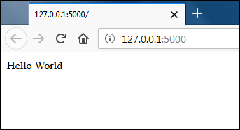


Остановить сервер можно с помощью комбинации *CTRL+C*.


## **Создание приложения Flask**

У каждого Flask-приложения должен быть экземпляр класса. Экземпляр — это WSGI-приложение (WSGI – это интерфейс для взаимодействия сервера с фреймворком), которое показывает, что сервер передает все полученные запросы экземпляру для дальнейшей обработки. *Объект* класса **Flask** создается следующим образом:

``from flask import Flask``

``app = Flask(__name__)``

В первой строке класс **Flask** импортируется из пакета **flask**.

Во второй строке создается объект **Flask**. Для этого конструктору **Flask** назначается аргумент ``__name__``. *Конструктор* **Flask** должен иметь *один обязательный аргумент*. Им служит *название пакета*. В большинстве случаев значение ``__name__`` подходит. Название пакета приложения используется фреймворком **Flask**, чтобы находить статические файлы, шаблоны и т. д.


## **Создание route (путей)**

**Маршрут** (или **путь**) используется во фреймворке **Flask** для привязки **URL** к функции представления. Эта функция отвечает на запрос. Во **Flask** декоратор route используется, чтобы связать **URL** адрес с функций. Вот как маршрут создается.

```
{
@app.route('/')
def index():
    return 'Hello World'
}
```

Этот код назначает функцию index() обработчиком корневого URL в приложении. Другими словами, каждый раз, когда приложение будет получать запрос, где путь — /, вызывается функция index(), и на этом запрос завершается.

Как вариант можно использовать метод add_url_rule() вместо декоратора route для маршрутизации. add_url_rule() — это простой метод, а не декоратор. Помимо URL он принимает конечную точку и название функции представления. Конечная точка относится к уникальному имени маршрута. Обычно, название функции представления — это и есть конечная точка. Flask может генерировать URL из конечной точки, но об этом позже. Предыдущий код аналогичен следующему:

```
{
def index():
    return 'Hello World'

app.add_url_rule('/', 'index', index)
}
```

Декоратор **route** используется в большинстве случаев, но у ``add_url_rule()`` есть свои преимущества.

Функция представления должна вернуть строку. 
Если пытаться вернуть что-то другое, сервер ответит ошибкой **500 Internal Sever Error.**

Можно создать столько столько, сколько нужно приложению. Например, в следующем списке **3 пути**:

```
{
@app.route('/')
def index():
    return 'Home Page'

@app.route('/career/')
def career():
    return 'Career Page'

@app.route('/feedback/')
def feedback():
    return 'Feedback Page'

}
```

Когда **URL** в маршруте заканчивается завершающим слешем (**/**), то **Flask** перенаправляет запрос без слеша на **URL** со слешем. Так, запрос к ``/career`` будет перенаправлен на ``/career/``.

Для одной функции представления может быть использовано несколько URL. 
Например:
```
{
@app.route('/contact/')
@app.route('/feedback/')
def feedback():
    return 'Feedback Page'
}
```

В этом случае в ответ на запросы ``/contact/`` или ``/feedback/``, будет вызвана функция **feedback()**.

Если перейти по адресу, для которого нет соответствующей функции представления, появится ошибка ``404 Not Found``.

Эти маршруты *статичны*. Большая часть современных приложений имеют *динамичные URL*. 
**Динамичный URL** – это адрес, который состоит из одной или нескольких изменяемых частей, влияющих на вывод страницы. Например, при создании веб-приложения со страницами профилей, у каждого пользователя будет уникальный **id**. Профиль первого пользователя будет на странице **/user/1**, второго — на **/user/2** и так далее. Очень неудобный способ добиться такого результата — создавать маршруты для каждого пользователя отдельно.

Вместе этого можно отметить динамические части **URL** как (**переменные**). Эти части потом будут передавать ключевые слова функции отображения. Следующий код демонстрирует путь с динамическим элементом.
```
{
@app.route('/user//')
def user_profile(id):
    return "Profile page of user #{}".format(id)
}
```
В этом примере на месте будет указываться часть **URL**, которая идет после **/user/**. 
Например, если зайти на **/user/100/**, ответ будет следующим:

``Profile page of user #100``

Этот элемент не ограничен числовыми **id**. Адрес может быть ``/user/cowboy/``, ``/user/foobar10/``, ``/user/@@##/`` и так далее. Но он *не будет работать со следующими URL*: ``/user/``, ``/user/12/post/``. Можно ограничить маршрут, чтобы он работал только с числовыми **id** после **/user/**. Это делается с помощью **КОНВЕРТЕРА**.

По умолчанию динамические части **URL** передаются в функцию в виде строк. Это можно изменить с помощью **конвертера**, который указывается перед динамическими элементами URL с помощью ``_``(пробела) . 

Например, ``/user//`` будет работать с адресами ``/user/1/``, ``/user/200/`` и другими. 
Но ``/user/cowboy/``, ``/user/foobar10/`` и ``/user/@@##/`` не будет.

**Список всех доступных во Flask конвертеров:**

| Конвертер	 |                                                          |
|:----------:|:---------------------------------------------------------|
|string   	 | принимает любые строки (значение по умолчанию).          |
|int	     | принимает целые числа.                                   |
|float	     | принимает числа с плавающей точкой.                      |
|path	     | принимает полный путь включая слеши и завершающий слеш.  |
|uuid	     | принимает строки uuid (символьные id).                   |


## **Запуск сервера**


Для запуска сервера разработки нужно использовать метод run() объекта Flask.

if __name__ == "__main__":
    app.run()


Условие __name__ == "__main__" гарантирует, что метод run() будет вызван только в том случае, если main.py будет запущен, как основная программа. Если попытаться использовать метод run() при импорте main.py в другой модуль Python, он не вызовется.

Важно: сервер разработки Flask используется исключительно для тестирования, поэтому его производительность невысокая.

Теперь должно быть понятнее, как работает main.py.


## **Режим отладки (Debug)**

Баги неизбежны в программировании. Поэтому так важно знать, как находить ошибки в программе и исправлять их. Во Flask есть мощный интерактивный отладчик, который по умолчанию отключен. Когда он выключен, а в программе обнаруживается ошибка, функция показывает 500 Internal Sever Error. Чтобы увидеть это поведение наглядно, можно специально добавить баг в файл main.py.

from flask import Flask

app = Flask(__name__)

@app.route('/')
def index():
    print(i)
    return 'Hello World'
    
if __name__ == "__main__":
    app.run()
В этом случае программа пытается вывести значение неопределенной переменной i, что приводит к ошибке. Если открыть https://127.0.0.1:5000/, то появится ошибка ``500 Internal Sever Error``.

*Тем не менее сам браузер не сообщает о типе ошибки. Если посмотреть в консоль, то можно увидеть отчет об ошибке. В данном случае он выглядит вот так:*

```
{
File "/home/gvido/flask_app/env/lib/python3.5/site-packages/flask/app.py", line 1612, in full_dispatch_request
    rv = self.dispatch_request()
  File "/home/gvido/flask_app/env/lib/python3.5/site-packages/flask/app.py", line 1598, in dispatch_request
    return self.view_functions[rule.endpoint](**req.view_args)
  File "main.py", line 13, in index
    print(i)

NameError: name 'i' is not defined
}
```


*Когда режим отладки выключен, после изменения кода нужно каждый раз вручную запускать сервер, чтобы увидеть изменения. Но режим отладки будет перезапускать его после любых изменений в коде.*

* Чтобы включить режим, нужно передать аргумент debug=True методу run():

```
{
if __name__ == "__main__":
    app.run(debug=True)
}
```

* Еще один способ — указать значение True для атрибута debug.

```
{

from flask import Flask

app = Flask(__name__)
app.debug = True

}
```

* После обновления файл main.py следующим образом его можно запускать.*

```
{
from flask import Flask

app = Flask(__name__)

@app.route('/')
def index():
    print(i)
    return 'Hello World'

if __name__ == "__main__":
    app.run(debug=True) # add debug mode

}
```
Теперь при открытии https://127.0.0.1:5000/ на странице будет отладчик.

Теперь, когда отладчик включен, вместо ошибки *500 Internal Server* на странице будет отображаться отчет об ошибке. Он в полной мере описывает, какая ошибка случилась. Внизу страницы видно, что оператор ``print`` пытался вывести значение неопределенной переменной ``i``. Там же указан тип ошибки, *NameError*, что подтверждает то, что ошибка заключается в том, что имя ``i`` не определено.

Кликнув на строчку кода на странице вывода ошибки, можно получить исходный код, где эта ошибка обнаружена, а также предыдущие и следующие строчки. Это помогает сразу понять контекст ошибки:

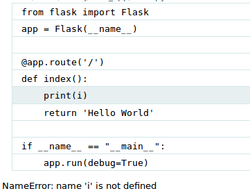

При наведении на строчку кода отображается иконка терминала. Нажав на нее, откроется консоль, где можно ввести любой код Python:

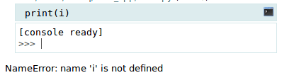

В ней можно проверить локальные переменные:


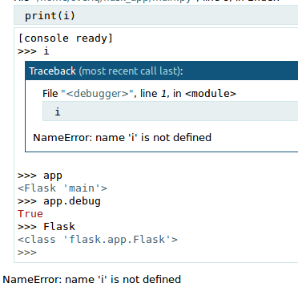


Если консоль открывается первый раз, то нужно ввести PIN-код:

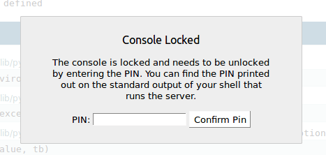

Это мера безопасности, призванная ограничить доступ к консоли неавторизованным пользователям. Посмотреть код можно в консоли при запуске сервера. Он будет указан в начале вывода:

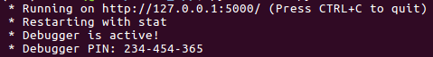


### **Завершить урок стоит созданием еще одного приложения Flask с применением всех имеющихся знаний.**

#### Создаем еще один файл **main2.py** со следующим кодом:

```
{
from flask import Flask

app = Flask(__name__)

@app.route('/')
def index():
    return 'Hello Flask'

@app.route('/user//')
def user_profile(user_id):
    return "Profile page of user #{}".format(user_id)

@app.route('/books//')
def books(genre):
    return "All Books in {} category".format(genre)

if __name__ == "__main__":
    app.run(debug=True)
}
```

* Если запустить файл и зайти на https://127.0.0.1:5000/, браузер поприветствует выражением **«Hello Flask»**:

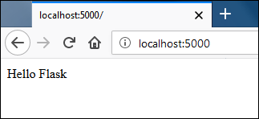

В этой новой версии приложения есть два динамических пути. Если в браузере ввести https://127.0.0.1:5000/user/123/, откроется страница со следующим содержанием:

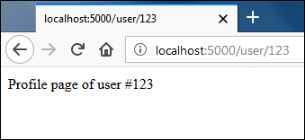


Стоит заметить, что путь /user// будет работать только с теми URL, где динамическая часть (user_id) представлена числом.

Чтобы проверить второй динамический путь, нужно открыть https://127.0.0.1:5000/books/sci-fi/. В этот раз получится следующее:

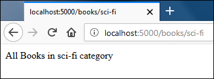


Если сейчас попробовать открыть **URL**, который не определен в путях, выйдет ошибка *404 Not Found*. Например, такой ответ получите при попытке перейти на https://127.0.0.1:5000/products.


# **Как Flask обрабатывает запрос?**


**Откуда Flask знает, какую функцию выводить, когда он получает запрос от клиента?**

Flask сопоставляет URL и функции отображения, которые будут выводиться. Определение соответствий (маршрутизация) создается с помощью декоратора route или метода add_url_rule() в экземпляре Flask. Получить доступ к этим соответствиям можно с помощью атрибута url_map у экземпляра Flask.

```
{

>>>
>>> from main2 import app
>>> app.url_map
Map([<Rule '/' (OPTIONS, GET, HEAD) -> index>,
<Rule '/static/' (OPTIONS, GET, HEAD) ->  static>,
<Rule '/books/' (OPTIONS, GET, HEAD) ->  books>,
<Rule '/user/' (OPTIONS, GET, HEAD) ->  user_profile>])
>>>

}
```
Как видно, есть 4 правила. Flask определяет соответствия URL в следующем формате:

``url pattern, (comma separated list of HTTP methods handled by the route) -> view function to execute``

Путь ``/static/`` автоматически добавляется для статических файлов Flask. О работе со статическими файлами речь пойдет в отдельном уроке «Обслуживание статических файлов во Flask».
---


# **4. Контексты во Flask**

Flask использует **контексты**, чтобы временно делать определенные глобальные доступными в глобальной области видимости.

Знакомые с Django могут обратить внимание на то, что функция представления во Flask не принимает request первым аргументом. Во Flask доступ к данным осуществляется с помощью входящего запроса, используя объект request:

```
{
from flask import Flask, request

@app.route('/')
def requestdata():
    return "Hello! Your IP is {} and you are using {}: ".format(request.remote_addr,  
                                                                request.user_agent)

}
```

Код выше может создать впечатление, что **request** — это глобальный объект, но на самом деле это не так. Если бы **request** был глобальным объектом, тогда в многопоточной программе приложение не смогло бы различать два одновременных процесса, поскольку программа такого типа распределяет все переменные по потокам. Во Flask используется то, что называется “**Контекстами**”. Они заставляют отдельные переменные вести себя как глобальные. Обращаясь к этим переменным, пользователь получает доступ к объекту в конкретном потоке. Технически такие переменные называются локальными или внутрипоточными.

Согласно документации **Flask** существует **два** вида **контекстов**:

   * *Контекст приложения*

   * *Контекст запроса*

**Контекст приложения** используется для хранения общих переменных приложения, таких как подключение к базе данных, настройки и т. д. А контекст запроса используется для хранения переменных конкретного запроса.
**Контекст приложения** предлагает такие объекты как **current_app** или **g. current_app** ссылается на экземпляр, который обрабатывает запрос, а g используется, чтобы временно хранить данные во время обработки запроса. Когда значение установлено, к нему можно получить доступ из любой функции представления. Данные в **g** сбрасываются после каждого запроса.

**Контекст запроса** также как и контекст приложения,  предоставляет объекты: **request** и **session**. 
В свою очередь **request** содержит информацию о текущем запросе, а **session** — это словарь (**dict**), в котором хранятся значения, которые сохраняются между запросами.

#### СПРАВКА:

**Словарь** — это неупорядоченная последовательность, гибким к изменениям и индексированным. В Python словари пишутся в фигурных скобках, и состоят из ключей и значений.
Создадим и выведем словарь:

```
{
thisdict = {
"brand": "Samsung",
"model": "A500",
"year": 2060
}
print(thisdict)

Вывод:
{'brand': 'Samsung', 'model': 'A500', 'year': 2060} 

}
```

**Продолжим:**

**Flask** активирует *контексты* приложения и запроса, когда запрос получен и удаляет их, когда он обработан. Когда используется контекст приложения, все его переменные становятся доступным для потока. То же самое происходит и с контекстом запроса. Когда он активируется, его переменные могут быть использованы в потоке. Внутри функций представления можно получить доступ ко всем объектам контекстов приложения и запроса, так что не стоит волноваться о том, активны ли контексты или нет. Но если попробовать получить к ним доступ вне функции представления или в консоли Python, выйдет ошибка. 
Следующий пример демонстрирует ее:

```
{

>>> from flask import Flask, request, current_app
>>>
>>>  request.method # получаем метод запроса
Traceback (most recent call last):
#...
RuntimeError: Working outside of request context.

This typically means that you attempted to use functionality that needed an active HTTP request. 
Consult the documentation on testing for information about how to avoid this problem.
>>>

}
```

* Наш **request_method** возвращает **HTTP-метод**, используемый в запросе, но поскольку самого **HTTP**-запроса нет, то и контекст запроса не активируется.

Похожая ошибка возникнет, если попытаться получить доступ к объекту, который предоставляется контекстом приложения:
```
{

>>> current_app.name        # получим название приложения
Traceback (most recent call last):
#...
RuntimeError: Working outside of application context.

This typically means that you attempted to use functionality that needed to interface with  the current application object in a way. To solve this set  up an application context with app.app_context(). See the documentation for more information.
>>>

}
```

Чтобы получить доступ к объектам, предоставляемым контекстами приложения и запроса вне функции представления, нужно сперва создать соответствующий контекст.


**Создать контекст приложения можно с помощью метода *app_context()* для экземпляра Flask.**

```
{

from main2 import app
from flask import Flask, request, current_app

app_context = app.app_context()
app_context.push()

current_app.name

'main2'

}
```

Предыдущий код можно упростить используя выражение **with** следующим образом:

```
{

from main2 import app
from flask import request, current_app

with app.app_context():
... current_app.name
...
'main2'

}
```
При создании контекстов лучше всего использовать выражение **with**.

Похожим образом можно создавать контекст запроса с помощью метода ``test_request_context()`` в *экземпляре* Flask. 
**Важно запомнить**, что когда активируется **контекст запроса**, тогда создается **контекст приложения**, если его не было до этого. 
Следующий код демонстрирует процесс создания контекста запроса:

```
{

from main2 import app
from flask import request, current_app


with app.test_request_context('/products'):
... request.path  # получим полный путь к запрашиваемой странице(без домена).
... request.method
... current_app.name
...
'/products'
'GET'
'main2'

}
```
Адрес ``/products`` выбран произвольно.
Это все, что нужно знать о контекстах во **Flask.**

---


# **5. Ответ сервера и перехват запросов во Flask**

### Flask предлагает три варианта для создания ответа:

   1. **В виде строки или с помощью шаблонизатора**

   2. **Объекта ответа**

   3. **Кортежа в формате (response, status, headers) или (response, headers)**


### Создание ответа в виде строки
```
{

@app.route('/books/')
def books(genre):
    return "All Books in {} category".format(genre)

}
```

До сих пор этот способ использовался, чтобы отправлять ответ клиенту. Когда **Flask видит**, что из *функции представления* возвращается строка, он автоматически конвертирует ее в *объект ответа* (с помощью метода **make_response()**) со строкой, содержащей тело ответа, статус-код *HTTP 200* и значение *text/html* в заголовке *content-type*. В большинстве случаев это — все, что нужно. Но иногда необходимы дополнительные заголовки перед отправлением ответа клиенту. Для этого создавать ответ нужно с помощью функции **make_response()**.


### Создание ответа с помощью *make_response()*

Синтаксис **make_response()** следующий:

``res_obj = make_response(res_body, status_code=200)``

где:

**res_body** — обязательный аргумент, представляющий собой тело ответа, 

**status_code** — опциональный аргумент, по умолчанию его значение равно 200.

* Следующий код показывает, как добавить дополнительные заголовки с помощью функции **make_response()**:
```
{

from flask import Flask, make_response,

@app.route('/books/')
def books(genre):
    res = make_response("All Books in {} category".format(genre))
    res.headers['Content-Type'] = 'text/plain'
    res.headers['Server'] = 'Foobar'
    return res

}
```

* Следующий — демонстрирует, как вернуть ошибку **404** с помощью **make_response()**:
```
{

@app.route('/')
def http_404_handler():
    return make_response("404 Error", 400)

}
```

**Настройка куки** — еще одна базовая задача для любого веб-приложения. 
Функция **make_response()** максимально ее упрощает. 

* Следующий код устанавливает два **куки** в клиентском браузере:
```
{

@app.route('/set-cookie')
def set_cookie():
    res = make_response("Cookie setter")
    res.set_cookie("favorite-color", "skyblue")
    res.set_cookie("favorite-font", "sans-serif")
    return res

}
```

**Примечание:** *куки обсуждаются подробно в разделе «Куки во Flask».*

**Куки**, заданные в вышеуказанном коде, будут активны до конца сессии в браузере. Можно указать собственную дату истечения их срока, передав в качестве третьего аргумента в методе **set_cookie()** количество секунд. 

**Пример:**
```
{

@app.route('/set-cookie')
def set_cookie():
    res = make_response("Cookie setter")
    res.set_cookie("favorite-color", "skyblue", 60*60*24*15)
    res.set_cookie("favorite-font", "sans-serif", 60*60*24*15)
    return res

}
```

В этом примере куки будут храниться *15 дней.*

### Последний способ создать ответ — использовать кортежи в одном из следующих форматов:

  * **(response, status, headers)**

  * **(response, headers)**

  * **(response, status)**

**response** — это строка, представляющая собой тело ответа, 

**status** — это код состояния HTTP, который может быть указан в виде целого числа или строки, 

**headers** — это словарь со значениями заголовков.
```
@app.route('/')
def http_500_handler():
    return ("500 Error", 500)
```
Функция представления вернет ошибку *HTTP 500 Internal Server Error*. 

Поскольку при создании кортежей можно не писать скобки, вышеуказанный код можно переписать следующим образом:
```
@app.route('/')
def http_500_handler():
    return "500 Error", 500
```

Следующий код демонстрирует, как указать заголовки с помощью кортежей:
```
@app.route('/')
def render_markdown():
    return "## Heading", 200, {'Content-Type': 'text/markdown'}
```

Функция представления перенаправляет пользователя на https:

```
@app.route('/transfer')
def transfer():
    return "", 302, {'location': 'https://localhost:5000/login'}
```

Функция представления перенаправляет пользователя на https://localhost:5000/login с помощью ответа 302 (временное перенаправление). 

**Перенаправление пользователей** — настолько распространенная практика, что во Flask для этого есть даже отдельная функция **redirect()**.

```
from flask import Flask, redirect

@app.route('/transfer')
def transfer():
    return redirect("https://localhost:5000/login")
```

По умолчанию, **redirect()** осуществляет **302** редиректы. Чтобы использовать **301**, нужно указать это в функции **redirect()**:

```
from flask import Flask, redirect

@app.route('/transfer')
def transfer():
    return redirect("https://localhost:5000/login", code=301)

```

### Перехват запросов

В веб-приложениях часто нужно исполнить определенный код до или после запроса. Например, нужно вывести весь список IP-адресов пользователей, которые используют приложение или авторизовать пользователя до того как показывать ему скрытые страницы. Вместе того чтобы копировать один и тот же код внутри каждой функции представления, Flask предлагает следующие **декораторы**:

* **before_first_request**: этот декоратор выполняет функцию еще до обработки первого запроса

* **before_request**: выполняет функцию до обработки запроса

* **after_request**: выполняет функцию после обработки запроса. Такая функция не будет вызвана при возникновении исключений в обработчике запросов. Она должна принять объект ответа и вернуть тот же или новый ответ.

* **teardown_request**: этот декоратор похож на after_request. Но вызванная функция всегда будет выполняться вне зависимости от того, возвращает ли обработчик исключение или нет.

**Примечание:** если функция в **before_request** возвращает ответ, тогда обработчик запросов не вызывается.

Следующий код демонстрирует, как использовать эти точки перехвата во **Flask**. Нужно создать новый файл **hooks.py** с таким кодом:

```
from flask import Flask, request, g

app = Flask(__name__)

@app.before_first_request
def before_first_request():
    print("before_first_request() called")

@app.before_request
def before_request():
    print("before_request() called")

@app.after_request
def after_request(response):
    print("after_request() called")
    return response

@app.route("/")
def index():
    print("index() called")
    return 'Testings Request Hooks'

if __name__ == "__main__":
    app.run(debug=True)

```

После этого необходимо запустить сервер и сделать первый запрос, перейдя на страницу https://localhost:5000/. 

В консоли, где был запущен сервер, должен появиться следующий вывод:
```
before_first_request() called
before_request() called
index() called
after_request() called
```
**Примечание:** записи о запросах к серверу опущены для краткости.

После перезагрузки страницы отобразится следующий вывод:
```
before_request() called
index() called
after_request() called
```
Поскольку это второй запрос, функция **before_first_request()** не будет вызываться.

### Отмена запроса с помощью abort()

Flask предлагает функцию **abort()** для отмены запроса с конкретным типом ошибки: **404**, **500** и так далее. 

**Пример:**
```
from  flask import  Flask,  abort

@app.route('/')
def index():
    abort(404)
    # код после выполнения abort() не выполняется
```

Эта функция представления вернет стандартную страницу ошибки 404, которая выглядит вот так:


**abort()** покажет похожие страницы для других типов ошибок. Если нужно изменить внешний вид страниц с ошибками, необходимо использовать *декоратор* - **errorhandler**.


### Изменение страниц ошибок

Декоратор **errorhandler** используется для создания пользовательских страниц с ошибками. Он принимает один аргумент — *ошибку HTTP*, — для которой создается страница. Откроем файл **hooks.py** для создания кастомных страниц ошибок **404** и **500** с помощью *декоратора*:

```
from flask import Flask, request, g, abort
#...
#...
@app.after_request
def after_request(response):
    print("after_request() called")
    return response

@app.errorhandler(404)
def http_404_handler(error):
    return "HTTP 404 Error Encountered", 404

@app.errorhandler(500)
def http_500_handler(error):
    return "HTTP 500 Error Encountered", 500

@app.route("/")
def index():
    # print("index() called")
    # return 'Testings Request Hooks'
    abort(404)

if  __name__  ==  "__main__":
#...

```

Стоит отметить, что оба обработчика ошибок принимают один аргумент error, который содержит дополнительную информацию о типе ошибки.

Если сейчас посетить корневой URL, отобразится следующий ответ:


---

# 6. Шаблоны во Flask

До этого момента *HTML-строки* записывались прямо в функцию представления. Это нормально в демонстрационных целях, но неприемлемо при создании реальных приложений. Большинство современных веб-страниц достаточно длинные и состоят из множества динамических элементов. Вместо того чтобы использовать огромные блоки HTML-кода прямо в функциях (с чем еще и неудобно будет работать), применяются **шаблоны**.

### Шаблоны

**Шаблон** — это всего лишь текстовый файл с *HTML-кодом* и дополнительными элементами разметки, которые обозначают динамический контент. Последний станет известен в момент запроса. Процесс, во время которого динамическая разметка заменяется, и генерируется статическая *HTML-страница*, называется отрисовкой (или рендерингом) шаблона. Во **Flask** есть встроенный движок шаблонов **Jinja2**, который и занимается тем, что конвертирует шаблон в статический HTML-файл.

**Jinja2** — один из самых мощных и популярных движков для обработки шаблонов для языка Python. Он должен быть известен пользователям **Django**. Но стоит понимать, что **Flask** и **Jinja2** – два разных пакета, и они могут использоваться отдельно.


### Отрисовка шаблонов с помощью *render_template()*

По умолчанию, **Flask** ищет шаблоны в подкаталоге **templates** внутри папки приложения. Это поведение можно изменить, передав аргумент **template_folder** конструктору **Flask** во время создания экземпляра приложения.

Этот код меняет расположение шаблонов по умолчанию на папку **jinja_templates** внутри папки приложения:

```
app = Flask(__name__, template_folder="jinja_templates")

```
Сейчас в этом нет смысла, поэтому пока стоит продолжать использовать папку **templates** для хранения шаблонов.

Создаем новую папку **templates** внутри папки приложения **flask_app**. В **templates** — файл *index.html* со следующим кодом:

```
<!DOCTYPE html>
<html lang="en">
<head>
  <meta charset="UTF-8">
  <title>Title</title>
</head>
<body>

  <p>Name: {{ name }}</p>

</body>
</html>

```

Стоит обратить внимание, что в «базовом» HTML-шаблоне есть динамический компонент {{ name }}. Переменная name внутри фигурных скобок представляет собой переменную, значение которой будет определено во время отрисовки шаблона. В качестве примера можно написать, что значением name будет Jerzy. Тогда после рендеринга шаблона выйдет следующий код:

```
<!DOCTYPE html>
<html lang="en">
<head>
  <meta charset="UTF-8">
  <title>Title</title>
</head>
<body>

  <p>Name: Jerzy</p>

</body>
</html>

```

**Flask** предоставляет функцию **rended_template** для отрисовки шаблонов. Она интегрирует **Jinja2** во **Flask**. Чтобы отрисовать шаблон, нужно вызвать **rended_template()** с именем шаблона и данными, которые должны быть в шаблоне в виде *аргументов-ключевых слов*. Аргументы-ключевые слова, которые передаются шаблонам, известны как *контекст шаблона*. 

Следующий код показывает, как отрисовать шаблон *index.html* с помощью **render_template()**:

```

from flask import Flask, request, render_template

app = Flask(__name__)

@app.route('/')
def index():
    return render_template('index.html', name='Jerry')
#...

```

**Важно:** обратите внимание на то, что ``name`` в ``name='Jerzy'`` ссылается на переменную, упомянутую в шаблоне *index.html*.

Если сейчас зайти на https://localhost:5000/, выйдет следующий ответ:


Если **render_template()** нужно передать много аргументов, можно не разделять их запятыми (**,**), а создать *словарь* и использовать оператор ``**``, чтобы передать аргументы-ключевые слова функции. 

**Пример:**

```
@app.route('/')
def index():
    name, age, profession = "Jerry", 24, 'Programmer'
    template_context = dict(name=name, age=age, profession=profession)
    return render_template('index.html', **template_context)

```
Шаблон **index.html** теперь имеет доступ к трем переменным шаблона: **name**, **age** и **profession**.

Что случится, если не определить контекст шаблона?

Ничего не случится, не будет ни предупреждений, ни исключений. **Jinja2** отрисует шаблон как обычно, а на местах пропусков использует пустые строки. Чтобы увидеть это поведение, необходимо изменить функцию представления **index()** следующим образом:

```
#...
@app.route('/')
def index():
    return render_template('index.html')
#...

```

Теперь при открытии https://localhost:5000/ выйдет следующий ответ:

```
<!DOCTYPE html>
<html lang="en">
<head>
  <meta charset="UTF-8">
  <title>Title</title>
</head>
<body>

  <p>Name: </p>

</body>
</html>

```

Сейчас должна сложиться картина того, как используются шаблоны во **Flask**, а в следующем разделе речь пойдет о том, как рендерить их в консоли.


### Отрисовка шаблонов в консоли

Для тестирования рендерить шаблоны можно и в консоли. Это просто и не требует создания нескольких файлов. Для начала нужно запустить **Python** и импортировать класс *Template* из пакета **jinja2** следующим образом.
```
>>>  from jinja2 import Template
```

Для создания объекта ``Templates`` нужно передать содержимое шаблона в виде **строки**:
```
>>>  t = Template("Name: {{ name }}")
```

Чтобы отрендерить шаблон, нужно вызвать метод **render()** объекта ``Template`` вместе с данными аргументами-ключевыми словами:

```
>>> t.render(name='Jerry')
'Name: Jerry'

```

---

# 7. Основы шаблонизатора *Jinja2*

*Язык шаблонов (или шаблонизатор)* **Jinja2** — это маленький набор инструкций, который помогает автоматизировать создание HTML шаблонов. **Jinja2** это самый популярный шаблонизатор в языке программирования Python. 

**Шаблонизаторы** - это инструменты, позволяющие разделять структуру и логику веб-страницы или другого документа от её контента. Они широко используются в веб-разработке для создания динамических веб-страниц. Шаблонизаторы часто связаны с конкретными языками программирования и фреймворками. Ниже перечислены некоторые популярные шаблонизаторы и языки программирования, с которыми они часто используются:

**Jinja2**: Это шаблонизатор для языка Python, часто используется во фреймворке *Flask*, *FastAPI*.

**Django Template Language**: Используется во фреймворке *Django* для Python.

**Smarty**: Шаблонизатор для *PHP*, используется, например, в популярной *CMS - WordPress*.

**Twig**: Ещё один *PHP* шаблонизатор, используется во фреймворке *Symfony*.

**Handlebars.js**: Шаблонизатор, который может быть использован с *JavaScript* и *Node.js*.

**EJS (Embedded JavaScript)**: Шаблонизатор для *JavaScript*, который может использоваться в браузере и на сервере через *Node.js*.

**Mustache**: Шаблонизатор, который поддерживается многими языками программирования, включая *JavaScript*, *Python*, *Ruby*, *Java* и другие.

**Razor**: Шаблонизатор, используемый в *ASP.NET* для *C#* или *Visual Basic*.

**Freemarker**: Шаблонизатор, который может быть использован в *Java*.

**Velocity**: Ещё один шаблонизатор для *Java*.


Синтаксис **Jinja2** сильно похож на **Django-шаблонизатор**, но при этом дает возможность использовать чистые Python выражения и поддерживает гибкую систему расширений.


### Переменные, выражения и вызовы функций

В **Jinja2** двойные фигурные скобки **{{ }}** позволяют получить результат выражение, переменную или вызвать функцию и вывести значение в шаблоне. 

**Пример:**
*Определение выражения*
```
>>> from jinja2 import Template
>>>
>>> Template("{{ 10 + 3 }}").render()
'13'
>>> Template("{{ 10 - 3 }}").render()
'7'
>>>
>>> Template("{{ 10 // 3 }}").render()
'3'
>>> Template("{{ 10 / 3 }}").render()
'3.3333333333333335'
>>>
>>> Template("{{ 10 % 3 }}").render()
'1'
>>> Template("{{ 10 ** 3 }}").render()
'1000'
>>>
```
Другие операторы сравнения и присваивания и логические операторы *Python* также могут использоваться внутри выражений.


### Вывод переменных

```

>>> Template("{{ var }}").render(var=12)
'12'
>>> Template("{{ var }}").render(var="hello")
'hello'
>>>

```

Это могут быть не только числа и строки Python. Шаблоны **Jinja2** работают со сложными данными, такими как списки, словари, кортежи и даже пользовательские классы.

```
>>> Template("{{ var[1] }}").render(var=[1,2,3])
'2'
>>> Template("{{ var['profession'] }}").render(var={'name':'tom', 'age': 25, 'profession': 'Manager' })
'Manager'
>>> Template("{{ var[2] }}").render(var=("c", "c++", "python"))
'python'
>>> class Foo:
... def __str__(self):
...     return "This is an instance of Foo class"
...
>>> Template("{{ var }}").render(var=Foo())
'This is an instance of Foo class'
>>>
```

Если обратится к индексу, который не существует, **Jinja2** просто выведет пустую строку:

```
>>> Template("{{ var[100] }}").render(var=("c", "c++", "python"))
''
>>>

```

В **Jinja2** для определения функции ее нужно просто вызвать:

```
>>> def foo():
...     return "foo() called"
...
>>>
>>> Template("{{ foo() }}").render(foo=foo)
'foo() called'
>>>

```

### Атрибуты и методы

Для доступа к атрибутам и методам объекта нужно использовать оператор доступ точка **(.)**:

```
>>> class Foo:
...     def __init__(self, i):
...         self.i = i
...     def do_something(self):
...         return "do_something() called"
...
>>>
>>> Template("{{ obj.i }}").render(obj=Foo(5))
'5'
>>>
>>> Template("{{ obj.do_something() }}").render(obj=Foo(5))
'do_something() called'
>>>

```

### Комментарии

В **Jinja2** используется следующий синтаксис для добавления комментариев в одну или несколько строк:

``{# комментарий #}``

```
{#
    это
    многострочный
    комментарий
#}
```

### Объявление переменных

Внутри шаблона можно задать переменную с помощью инструкции **set**.

````

```


```

*Переменные* определяются для хранения результатов сложных операций, так чтобы их можно было использовать дальше в шаблоне. 

*Переменные*, определенные вне управляющих конструкций (о них дальше), ведут себя как глобальные переменные и доступны внутри любой структуры. Тем не менее переменные, созданные внутри конструкций, ведут себя как локальные переменные и видимы только внутри этих конкретных конструкций. Единственное исключение — инструкция **if**.

**Управляющие конструкции** позволяют добавлять в шаблоны элементы управления потоком и циклы. По умолчанию, управляющие конструкции используют разделитель **** вместо двойных фигурных скобок **{{ ... }}**.

### Инструкция if

Инструкция **if** в **Jinja2** имитирует выражение **if** в *Python*, а значение условия определяет набор инструкции. 

**Пример:**

```

    <p>User has some bookmarks</p>


```

Если значение переменной **bookmarks** – **True**, тогда будет выведена строка:

 ``<p>User has some bookmarks</p>``

* Стоит запомнить, что в **Jinja2**, если у переменной нет значения, она возвращает **False**.


Также можно использовать условия **elif** и **else**, как в обычном коде *Python*. 

**Пример:**

```

    <p>Display newbie stages</p>

    <p>Display pro stages</p>

    <p>Display ninja stages</p>

    <p>You have completed all stages</p>


```

* Управляющие инструкции также могут быть *вложенными*:

**Пример:**
```

    
        <p>Display newbie stages</p>
    
        <p>Display pro stages</p>
    
        <p>Display ninja stages</p>
    
        <p>You have completed all states</p>
    

    <p>User is not defined</p>


```

В определенных случаях достаточно удобно записывать инструкцию **if** в одну строку. **Jinja2** поддерживает такой тип записи, но называет это *выражением if*, потому что оно записывается с помощью двойных фигурных скобок **{{ … }}**, а не ****. 

**Пример:**

```
{{ "User is logged in" if loggedin else "User is not logged in" }}

```

Здесь если переменная **loggedin** вернет *True*, тогда будет выведена строка ``“User is logged in”``. В противном случае — ``“User is not logged in”``.

Условие **else** использовать необязательно. Если его нет, тогда блок **else** вернет объект **undefined**:
```
{{ "User is logged in" if loggedin }}
```

Здесь, если переменная **loggedin** вернет *True*, будет выведена строка ``“User is logged in”``. В противном случае — **ничего**.

Как и в *Python* можно использовать операторы сравнения, присваивания и логические операторы для управляющих конструкций, чтобы создавать более сложные условия. Вот несколько примеров:
```
{# Если user.count ревен 1000, код '<p>User count is 1000</p>' отобразится #}

    <p>User count is 1000</p>


{# Если выражение 10 >= 2 верно, код '<p>10 >= 2</p>' отобразится #}

    <p>10 >= 2</p>


{# Если выражение "car" <= "train" верно, код '<p>car <= train</p>' отобразится #}

    <p>car <= train</p>


{#
    Если user залогинен и superuser, код
    '<p>User is logged in and is a superuser</p>' отобразится
#}

    <p>User is logged in and is a superuser</p>


{#
    Если user является superuser, moderator или author, код
    '<a href="#">Edit</a>' отобразится
#}

    <a href="#">Edit</a>


{#
    Если user и current_user один и тот же объект, код 
    <p>user and current_user are same</p> отобразится
#}

    <p>user and current_user are same</p>


{#
    Если "Flask" есть в списке, код 
    '<p>Flask is in the dictionary</p>' отобразится
#}

    <p>Flask is in the dictionary</p>


```

Если условия становятся слишком сложными, или просто есть желание поменять приоритет оператора, можно обернуть выражения скобками **()**:

```


    <p>You grade is B</p>


```

### Цикл for

Цикл **for** позволяет перебирать последовательность. 

**Пример:**

```


<ul>

    <li>{{ user }}</li>

</ul>
```

Вывод:
```
<ul>

    <li>tom</li>

    <li>jerry</li>

    <li>spike</li>

</ul>

```

Вот как можно перебирать значения словаря:
```


<ul>

<li>{{ key }} : {{ employee[key] }}</li>

</ul>
```

Вывод:
```
<ul>

    <li>designation : Manager</li>

    <li>name : tom</li>

    <li>age : 25</li>

</ul>

```

**Примечание:** в Python элементы словаря не хранятся в конкретном порядке, поэтому вывод может отличаться.


* Если нужно получить ключ и значение словаря вместе, используйте метод **items()**:

```


<ul>

<li>{{ key }} : {{ value }}</li>

</ul>
```

Вывод:
```
<ul>

    <li>designation : Manager</li>

    <li>name : tom</li>

    <li>age : 25</li>

</ul>

```

Цикл **for** также может использовать дополнительное условие **else**, как в Python, но зачастую способ его применения отличается. Стоит вспомнить, что в Python, если **else** идет следом за циклом **for**, условие **else** выполняется только в том случае, если цикл завершается после перебора всей последовательности, или если она пуста. Оно не выполняется, если цикл остановить оператором **break**.

Когда условие **else** используется в цикле **for** в **Jinja2**, оно исполняется только в том случае, если последовательность пустая или не определена. 

**Пример:**

```


<ul>

    <li>{{ user }}</li>

    <li>user_list is empty</li>

</ul>

```

Вывод:
```
<ul>

    <li>user_list is empty</li>

</ul>

```

По аналогии с вложенными инструкциями **if**, можно использовать вложенные циклы **for**. На самом деле, любые управляющие конструкции можно вкладывать одна в другую.

```

    <p>{{ user.full_name }}</p>
    <p>
        <ul class="follower-list">
            
            <li>{{ follower }}</li>
            
        </ul>
    </p>


```

Цикл **for** предоставляет специальную переменную loop для отслеживания прогресса цикла. 

**Пример:**

```
<ul>

    <li>{{ loop.index }} - {{ user }}</li>

</ul>
```

**loop.index** внутри цикла **for** начинает отсчет с **1**. 

В таблице упомянуты остальные широко используемые атрибуты переменной loop:

| Метод	 |                                                                             |
|:------:|:---------------------------------------------------------------------------|
|loop.index0	| то же самое что и loop.index, но с индексом 0, то есть, начинает считать с 0, а не с 1.|
|loop.revindex	| возвращает номер итерации с конца цикла (считает с 1).|
|loop.revindex0	| возвращает номер итерации с конца цикла (считает с 0).|
|loop.first	    | возвращает True, если итерация первая. В противном случае — False.|
|loop.last	    | возвращает True, если итерация последняя. В противном случае — False.|
|loop.length	| возвращает длину цикла(количество итераций).|

**Примечание:** *полный список есть в документации Flask.*

### Фильтры

**Фильтры** изменяют переменные до процесса рендеринга. 

*Синтаксис использования фильтров следующий:*
```
variable_or_value|filter_name
```

**Пример:**
```
{{ comment|title }}
```

Фильтр **title** делает заглавной первую букву в каждом слове. Если значение переменной **comment** — ``"dust in the wind"``, то вывод будет ``"Dust In The Wind"``.

Можно использовать несколько фильтров, чтобы точнее настраивать вывод. 

**Пример:**
```
{{ full_name|striptags|title }}
```
Фильтр **striptags** удалит из переменной все *HTML-теги*. В приведенном выше коде сначала будет применен фильтр **striptags**, а затем — **title**.

У некоторых фильтров есть *аргументы*. Чтобы передать их фильтру, нужно вызвать фильтр как функцию:

**Пример:**

```
{{ number|round(2) }}

```
Фильтр **round** округляет число до конкретного количества символов.

**В таблице указаны широко используемые фильтры:**

|Название	|                                                                          |
|:---------:|:-------------------------------------------------------------------------|      
|upper	    | делает все символы заглавными                                            |
|lower	    | приводит все символы к нижнему регистру                                  |
|capitalize |	делает заглавной первую букву и приводит остальные к нижнему регистру  |
|escape	    | экранирует значение                                                      |
|safe	    | предотвращает экранирование                                              | 
|length	    | возвращает количество элементов в последовательности                     |
|trim	    | удаляет пустые символы в начале и в конце                                |
|random	    | возвращает случайный элемент последовательности                          |

Примечание: полный список фильтров доступен в документации.

### Макросы

**Макросы** в **Jinja2** напоминают функции в *Python*. Суть в том, чтобы сделать код, который можно использовать повторно, просто присвоив ему название:

**Пример:**
```

    <div>
        
            <h2>{{ post.title }}</h2>
            <article>
                {{ post.html|safe }}
            </article>
        
        <hr>
    </div>

```
В этом примере создан макрос **render_posts**, который принимает обязательный аргумент **post_list** и необязательный аргумент **sep**. Использовать его нужно следующим образом:
```
{{ render_posts(posts) }}

```
Определение макроса должно идти до первого вызова, иначе выйдет ошибка.

> Вместо того чтобы использовать макросы прямо в шаблоне, лучше хранить их в отдельном файле и импортировать по надобности.

Предположим, все макросы хранятся в файле **macros.htm**l в папке **templates**. Чтобы импортировать их из файла, нужно использовать инструкцию **import**:
```


```
Теперь можно ссылаться на макросы в файле **macros.html** с помощью переменной **macros**. 

**Пример:**
```
{{ macros.render_posts(posts) }}
```
Инструкция ```` импортирует все макросы и переменные (определенные на высшем уровне) из файла **macros.html** в шаблон. Также можно импортировать определенные макросы с помощью **from**:
```

```
При использовании макросов будут ситуации, когда потребуется передать им произвольное число аргументов.

По аналогии с **/*args** и  ****kwargs** в Python внутри макросов можно получить доступ к **varargs** и **kwargs**.

- **varags**: сохраняет дополнительные позиционные аргументы, переданные макросу, в виде кортежа.

- **lwargs**: сохраняет дополнительные позиционные аргументы, переданные макросу, в виде словаря.

Хотя к ним можно получить доступ внутри макроса, объявлять их отдельно в заголовке макроса не нужно. 

**Пример:**

```

    <p>{{ para }}</p>
    <p>varargs: {{ varargs }}</p>
    <p>kwargs: {{ kwargs }}</p>


{{ custom_renderer("some content", "apple", name='spike', age=15) }}
```
В этом случае дополнительный позиционный аргумент, **"apple"**, присваивается **varargs**, а дополнительные аргументы-ключевые слова ``(name=’spike’, age=15)`` — **kwargs**.


### Экранирование

**Jinja2** по умолчанию автоматически экранирует вывод переменной в целях безопасности. Поэтому если переменная содержит, например, такой HTML-код: ``"<p>Escaping in Jinja</p>"``, он отрендерится в виде ``"&lt;p&gt;Escaping in Jinja&lt;/p&gt;"``. Благодаря этому HTML-коды будут отображаться в браузере, а не интерпретироваться. Если есть уверенность, что данные безопасны и их точно можно рендерить, стоит воспользоваться фильтром safe.
**Пример:**
```

{{ html|safe }}
```
Вывод:
```
<p>Escaping in Jinja</p>
```
Использовать фильтр **safe** в большом блоке кода будет неудобно, поэтому в **Jinja2** есть оператор **autoescape**, который используется, чтобы отключить экранирование для большого объема данных. Он может принимать аргументы *true* или *false* для включения и отключения экранирования, соответственно.
**Пример:**
```

    Escaping enabled



    Escaping disabled

```
Все между **** и **** отрендерится без экранирования символов.

* Если нужно экранировать отдельные символы при выключенном экранировании, стоит использовать фильтр **escape**. 

**Пример:**
```

    <div class="post">
        
            <h2>{{ post.title }}</h2>
            <article>
                {{ post.html }}
            </article>
        
    </div>
    <div>
        
            <p>{{ comment|escape }}</p> # escaping is on for comments
        
    </div>

```


### Вложенные шаблоны

Инструкция **include** рендерит шаблон внутри другого шаблона. Она широко используется, чтобы рендерить статический раздел, который повторяется в разных местах сайта. 

*Вот синтаксис **include**:*

Предположим, что навигационное меню хранится в файле **nav.html**, сохраненном в папке **templates**:
```
<nav>
    <a href="/home">Home</a>
    <a href="/blog">Blog</a>
    <a href="/contact">Contact</a>
</nav>
Чтобы добавить это меню в home.html, нужно использовать следующий код:

<!DOCTYPE html>
<html lang="en">
<head>
    <meta charset="UTF-8">
    <title>Title</title>
</head>
<body>

    {# добавляем панель навигации из nav.html #}
    

</body>
</html>
```

Вывод:
```
<!DOCTYPE html>
<html lang="en">
<head>
    <meta charset="UTF-8">
    <title>Title</title>
</head>
<body>

<nav>
    <a href="/home">Home</a>
    <a href="/blog">Blog</a>
    <a href="/contact">Contact</a>
</nav>

</body>
</html>
```

### Наследование шаблонов

**Наследование шаблонов** — один из самых мощных элементов шаблонизатора **Jinja2**. Его принцип похож на *ООП (объектно-ориентированное программирование)*.

 Все начинается с создания базового шаблона, который содержит в себе скелет HTML и отдельные маркеры, которые дочерние шаблоны смогут переопределять. Маркеры создаются с помощью инструкции **block**. Дочерние шаблоны используют инструкцию extends для наследования или расширения основного шаблона.

**Пример:**
```
{# Это шаблон templates/base.html #}
<!DOCTYPE html>
<html lang="en">
<head>
    <meta charset="UTF-8">
    <title>Default Title</title>
</head>
<body>

    
        <ul>
            <li><a href="/home">Home</a></li>
            <li><a href="/api">API</a></li>
        </ul>
    
    
    
    
    
</body>
</html>
```
Это базовый шаблон **base.html**. Он создает три блока с помощью **block**, которые впоследствии будут заполнены дочерними шаблонами. Инструкция **block** принимает один аргумент — *название блока*. Внутри шаблона это название должно быть уникальным, иначе возникнет ошибка.

**Дочерний шаблон** — это шаблон, который растягивает базовый шаблон. Он может добавлять, перезаписывать или оставлять элементы родительского блока. Вот как можно создать дочерний шаблон.
```
{# Это шаблон templates/child.html #}




    
        <p>{{ bookmark.title }}</p>
    

```
Инструкция extends сообщает **Jinja2**, что *child.html* — это дочерний элемент, наследник *base.html*. Когда **Jinja2** обнаруживает инструкцию **extends**, он загружает базовый шаблон, то есть **base.html**, а затем заменяет блоки контента внутри родительского шаблона блоками с теми же именами из дочерних шаблонов. Если блок с соответствующим названием не найден, используется блок родительского шаблона.

Стоит отметить, что в дочернем шаблоне перезаписывается только блок content, так что содержимое по умолчанию из title и nav будет использоваться при рендеринге дочернего шаблона. Вывод должен выглядеть следующим образом:

```

<!DOCTYPE html>
<head>
    <meta charset="UTF-8">
    <title>Default Title</title>
</head>
<body>

    <ul>
        <li><a href="/home">Home</a></li>
        <li><a href="/api">API</a></li>
    </ul>

    <p>Bookmark title 1</p>
    <p>Bookmark title 2</p>
    <p>Bookmark title 3</p>
    <p>Bookmark title 4</p>


</body>
</html>
```
Если нужно, можно поменять заголовок по умолчанию, переписав блок **title** в *child.html*:
```
{# Это шаблон templates/child.html #}



    Child Title



    
        <p>{{ bookmark.title }}</p>
    

```

После перезаписи блока на контент из родительского шаблона все еще можно ссылаться с помощью функции **super()**. Обычно она используется, когда в дополнение к контенту дочернего шаблона нужно добавить содержимое из родительского. 
**Пример:**
```
{# Это шаблон templates/child.html #}



    Child Title



    {{ super() }} {# referring to the content in the parent templates #}
    <li><a href="/contact">Contact</a></li>
    <li><a href="/career">Career</a></li>



    
        <p>{{ bookmark.title }}</p>
    

```
Вывод:
```
<!DOCTYPE html>
<head>
    <meta charset="UTF-8">
    <title>Child Title</title>
</head>
<body>

    <ul>
        <li><a href="/home">Home</a></li>
        <li><a href="/api">API</a></li>
        <li><a href="/contact">Contact</a></li>
        <li><a href="/career">Career</a></li>
    </ul>

    <p>Bookmark title 1</p>
    <p>Bookmark title 2</p>
    <p>Bookmark title 3</p>
    <p>Bookmark title 4</p>


</body>
</html>
```

Это все, что нужно знать о шаблонах **Jinja2**. В следующих уроках эти знания будут использованы для созданы крутых шаблонов.


# 8 Создание **URL** во **Flask**

Flask может генерировать URL с помощью функции **url_for()** из пакета **flask**. **URL** можно задавать вручную в шаблонах и функциях представления, но это не очень хорошая практика. Предположим, возникла необходимость поменять структуру ссылок для блога с `/<id>/<post-title>/` на `/<id>/post/<post-title>/` . Если **URL** были заданы вручную в шаблонах и функциях, тогда придется вручную редактировать их во всех местах. Функция **url_for()** позволяет произвести то же изменение одним щелчком.

Функция **url_for()** принимает конечную точку и возвращает **URL** в виде строки. Стоит напомнить, что конечная точка ссылается на уникальное имя **URL** и в большинстве случае — это имя функции представления. Например, сейчас **main2.py** имеет определенный корневой путь`(/)`:
```
#...
@app.route('/')
def index():
    return render_template('index.html', name='Jerry')
#...
Чтобы сгенерировать корневой URL, нужно вызвать url_for() следующим образом: url_for(‘index’). Выводом будет '/'. Следующий код демонстрирует, как использовать url_for() в консоли.

>>> from main2 import app
>>> from flask import url_for
>>>
>>> with app.test_request_context('/api'): # путь /api выбран произвольно
...     url_for('index')
...
'/'
>>>
```

Стоит обратить внимание, что сперва создается **контекст запроса** (и таким образом — контекст приложения). Если попробовать использовать **url_for()** внутри консоли без вызова контекста, выйдет ошибка. Больше о контекстах запросов и приложения можно прочитать [здесь](https://pythonru.com/uroki/4-konteksty-vo-flask)

Если **url_for()** не может создать **URL**, она вызовет исключение **BuildError**.

```
>>>
>>> with app.test_request_context('/api'):
... url_for('/api')
...
Traceback (most recent call last):
...
werkzeug.routing.BuildError: Could not build url for endpoint '/api
Did you mean 'static' instead?
>>>
```

Чтобы сгенерировать абсолютной **URL**, нужно передать функции **url_for()** аргумент **external=True**:

```
>>>
>>> with app.test_request_context('/api'):
...     url_for('index', _external=True)
...
'https://localhost:5000/'
>>>
```

Вместо того чтобы прописывать **URL** в функции **redirect()**, стоит всегда использовать **url_for()** для этого. 

**Пример:**
```
@app.route('/admin/')
def admin():
    if not loggedin:
        return redirect(url_for('login')) # если не залогинен, выполнять редирект на страницу входа
    return render_template('admin.html')

```

Чтобы сгенерировать **URL** для динамических адресов, нужно передать динамические части в виде аргументов-ключевых слов.

**Пример:**
```

>>>
>>> with  app.test_request_context('/api'):
...     url_for('user_profile', user_id = 100)
...
'/user/100/'
>>>
>>>
>>> with  app.test_request_context('/api'):
...     url_for('books', genre='biography')
...
'/books/biography/'
>>>
```

Дополнительные *аргументы-ключевые слова*, переданные функции **url_for()**, будут добавлены к **URL** в виде строки запроса.

```
>>>
>>> with  app.test_request_context('/api'):
...     url_for('books', genre='biography', page=2, sort_by='date-published')
...
'/books/biography/?page=2&sort_by=date-published'
>>>
```

**url_for()** — одна из тех функций, которую можно использовать внутри шаблона. 

Чтобы сгенерировать **URL** внутри шаблонов, нужно просто вызвать **url_for()** внутри фигурных скобок **{{ … }}**:

`<a href="{{ url_for('books', genre='biography') }}">Books</a>`

*Вывод:*

`<a href="/books/biography/">Books</a>`

---


# 9. Работа со статическими файлами во **Flask**

**Статические файлы** — это файлы, которые не изменяются часто. Это, например, файлы **CSS**, **JavaScript**, шрифты и так далее. По умолчанию **Flask** ищет статические файлы в папке **static**, которая хранится в папке приложения. Это поведение можно поменять, передав аргументу-ключевому слову **static_folder** название новой папки при создании экземпляра приложения:

`app = Flask(__name__, static_folder="static_dir")`

Это изменит расположение статических файлов по умолчанию на папку `static_dir` внутри папки приложения.

Пока что можно остановиться на папке по умолчанию - `statiс`.

Сперва нужно создать папку `static` в папке `flask_app`.

В `static` создаем *CSS-файл* **style.css** со следующим содержимым:

```

body {
  color: red
}

```

Стоит вспомнить, что в уроке *«Основы Flask»* речь шла о том, что *Flask* автоматически добавляет путь в формате `/static/<filename>` для обработки статических файлов. Поэтому все, что остается — это создать **URL** с помощью функции **url_for()**:

```

<script src="{{ url_for('static', filename='jquery.js') }}"></script>

```
*Вывод:*
`<script src="/static/jquery.js"></script>`

Дальше необходимо открыть шаблон **index.html** и добавить тег `<link>`:

```
<!DOCTYPE html>
<html lang="en">
<head>
    <meta charset="UTF-8">
    <title>Title</title>
    <link rel="stylesheet" href="{{ url_for('static', filename='style.css') }}">
</head>

...
```

Если сервер не запущен, его нужно запустить и открыть `https://localhost:5000/`. Там будет страница с красным текстом:

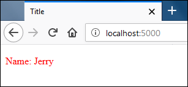

Этот метод работы со статическими файлами подходит только для разработки. При создании реальных приложений используются реальные веб-сервера, такие как *Nginx* или *Apache*.

---


# 10 Расширение возможностей **Flask** с помощью **Flask-Script**

**Расширения Flask** — это пакеты, которые можно установить, чтобы расширить возможности **Flask**. Их суть в том, чтобы обеспечить удобный и понятный способ интеграции пакетов во **Flask**. Посмотреть все доступные расширения можно на странице:

[посмотреть](https://flask.pocoo.org/extenstions/). 

На этой странице есть пакеты, возможности которых варьируются от отправки email до создания полноценных интерфейсов администратора. 

Важно помнить, что расширять возможности **Flask** можно не только с помощью его расширений. На самом деле, подойдет любой пакет из стандартной библиотеки **Python** или **PyPi**. Оставшаяся часть урока посвящена тому, как установить и интегрировать удобное расширение для **Flask** под названием **Flask-Script**.

### Расширение Flask-Script

**Flask-Script** — это удобное миниатюрное расширение, которое позволяет создавать интерфейсы командной строки, запускать сервер и консоль Python в контексте приложений, делать определенные переменные видимыми в консоли автоматически и так далее.

Стоит напомнить то, что обсуждалось в уроке *«Основы Flask»*. Для запуска сервера разработки на конкретном хосте и порте, их нужно передать в качестве аргументов-ключевых слов методу **run()**:
```

if __name__ == "__main__":
    app.run(debug=True, host="127.0.0.10", port=9000)

```

Проблема в том, что такой подход не гибкий. Намного удобнее передать хост и порт в виде параметров командной строки при запуске сервера. **Flask-Script** позволяет сделать это. 

Установить **Flask-Script** можно с помощью **pip**:

`(env) gvido@vm:~/flask_app$ pip install flask-script`


Чтобы использовать **Flask-Script** сперва нужно импортировать класс **Manager** из пакета **flask_script** и создать **экземпляр объекта Manager**, передав ему экземпляр приложения. Таким образом расширения **Flask** интегрируются. Сначала импортируется нужный класс из пакета, а затем создается экземпляр с помощью передачи ему экземпляра приложения. 

Нужно открыть файл **main2.py** и изменить его следующим образом:

```
from flask import Flask, render_template
from flask_script import Manager

app = Flask(__name__)
manager = Manager(app)

#...
```

Созданный объект **Manager** также имеет метод **run()**, который помимо запуска сервера разработки может считывать аргументы командной строки. Следует заменить строку `app.run(debug=True)` на `manager.run()`. 

К этому моменту **main2.py** должен выглядеть вот так:

```
from flask import Flask, render_template
from flask_script import Manager

app = Flask(__name__)
manager = Manager(app)

@app.route('/')
def index():
    return render_template('index.html', name='Jerry')

@app.route('/user/<int:user_id>/')
def user_profile(user_id):
    return "Profile page of user #{}".format(user_id)

@app.route('/books/<genre>/')
def books(genre):
    return "All Books in {} category".format(genre)

if __name__ == "__main__":
    manager.run()
```

Теперь у приложения есть доступ к базовым командам. Чтобы посмотреть, какие из них доступны, необходимо запустить файл **main2.py:**
```
(env) gvido@vm:~/flask_app$ python main2.py
usage: main2.py [-?] {shell,runserver} ...

positional arguments:
  {shell,runserver}
    shell		Runs  a  Python shell inside Flask application context.
    runserver		Runs the Flask development server  i.e.  app.run()

optional arguments:
-?, --help		show this  help message and  exit

```

Как показывает вывод, сейчас есть всего две команды: **shell** и **runserver**. 

* Начнем с команды **runserver**,она запускает веб-сервер. По умолчанию, он запускается на `127.0.0.1` на порте `5000`. Чтобы увидеть варианты для любой команды нужно ввести `--help` и саму команду. 

**Пример:**

```

(env) gvido@vm:~/flask_app$ python main2.py runserver --help
usage: main2.py runserver [-?] [-h  HOST] [-p  PORT]  [--threaded]
			  [--processes PROCESSES] [--passthrough-errors] [-d]
			  [-D] [-r] [-R] [--ssl-crt SSL_CRT]
			  [--ssl-key SSL_KEY]

Runs the Flask development server  i.e.  app.run()

optional arguments:
  -?, --help 		show this  help message and  exit
  -h HOST, --host HOST
  -p PORT, --port PORT
  --threaded
  --processes PROCESSES
  --passthrough-errors
  -d, --debug 		enable the Werkzeug debugger (DO NOT use in production
			code)
  -D, --no-debug	disable the Werkzeug debugger
  -r, --reload		monitor Python files for changes (not 100% safe for
			production use)
  -R, --no-reload 	do not  monitor Python files for changes
  --ssl-crt SSL_CRT 	Path to ssl certificate
  --ssl-key SSL_KEY 	Path to ssl key

```

* Самые широко используемые варианты для **runserver** — это **--host** и **--post**. С их помощью можно запустить сервер разработки на конкретном интерфейсе и порте. 

**Пример:**

```
(env) gvido@vm:~/flask_app$ python main2.py runserver  --host=127.0.0.2 --port 8000
* Running on http://127.0.0.2:8000/ (Press CTRL+C to quit)
```

По умолчанию команда **runserver** запускает сервер без отладчика. Включить его вручную можно следующим образом:

```
(env) gvido@vm:~/flask_app$ python main2.py runserver -d -r
 * Restarting with stat
 * Debugger is active!
 * Debugger PIN: 250-045-653
 * Running on http://127.0.0.1:5000/ (Press CTRL+C  to  quit)
```

Более простой способ запустить отладчик — выбрать значение **True** для атрибута **debug** у экземпляра объекта **(app)**. Для этого нужно открыть **main2.py** и изменить файл следующим образом:

```
#...
app = Flask(__name__)
app.debug = True
manager = Manager(app)
#...
```

### Далее о команде **shell**.

**shell** запускает консоль **Python** в контексте приложения **Flask**. Это значит, что все объекты внутри контекстов приложения и запроса будут доступны в консоли без создания дополнительных контекстов. Для запуска консоли нужно ввести следующую команду:

`(env) gvido@vm:~/flask_app$ python main2.py shell`

Получим доступ к определенным объектам.

```
>>>
>>> from flask import current_app, url_for, request
>>>
>>> current_app.name
'main2'
>>>
>>>
>>> url_for("user_profile", user_id=10)
'/user/10/'
>>>
>>> request.path
'/'
>>>
```

Как и ожидалось, это можно сделать, не создавая контексты приложения и запроса.

### Создание команд

Когда экземпляр **Manager** создан, можно приступать к созданию собственных команд. Есть два способа:

* С помощью **класса Command**

* С помощью **декоратора @command**

1. Создание команд с помощью **класса Command**

В файле **main2.py** добавим класс **Faker**:

```
#...
from flask_script import Manager, Command
#...

manager = Manager(app)

class Faker(Command):
    'Команда для добавления поддельных данных в таблицы'
    def run(self):
        # логика функции
        print("Fake data entered")
       
@app.route('/')
#...
```

Команда **Faker** была создана с помощью наследования класса **Command**. Метод **run()** вызывается при исполнении команды. Чтобы выполнить команду через командную строку, ее нужно добавить в экземпляр **Manager** с помощью метода **add_command()**:

```
#...
class Faker(Command):
    'Команда для добавления поддельных данных в таблицы'
    def run(self):
        # логика функции
        print("Fake data entered")
       
manager.add_command("faker", Faker())
#...
```

Теперь нужно снова вернуться в терминал и запустить файл **main2.py:**

```
(env) gvido@vm:~/flask_app$ python main2.py
usage: main2.py [-?] {faker,shell,runserver} ...

positional arguments:
  {faker,shell,runserver}
    faker  		Команда для добавления поддельных данных в таблицы
    shell		Runs  a  Python shell inside Flask application context.
    runserver		Runs the Flask development server  i.e.  app.run()

optional arguments:
-?, --help		show this  help message and  exit

```

Стоит обратить внимание, что теперь, в дополнение к **shell** и **runserver**, есть команда **faker**. Описание перед самой командой взято из строки документации **класса Faker**.

Для запуска нужно ввести следующую команду:

```
(env) gvido@vm:~/flask_app$ python main2.py faker
Fake data entered
```

2. Создание команд с помощью декоратора **@command**

Создание команд с помощью **класса Command** достаточно объемно. Как вариант, можно использовать **декоратор @command** экземпляра **класса Manager**. Для этого нужно открыть файл **main2.py** и изменить его следующим образом:

```
#...
manager.add_command("faker", Faker())

@manager.command
def foo():
    "Это созданная команда"
    print("foo command executed")

@app.route('/')
#...
```

Была создана простая команда **foo**, которая выводит **foo command executed** при вызове. **Декоратор @command** автоматически добавляет команду к существующему экземпляру **Manager**, так что не нужно вызывать метод **add_command()**. 

Чтобы увидеть, как используются команды, нужно вернуться обратно в терминал и запустить **main2.py**:

```
(env) gvido@vm:~/flask_app$ python main2.py
usage: main2.py [-?] {faker,foo,shell,runserver} ...

positional arguments:
  {faker,foo,shell,runserver}
    faker  		Команда для добавления поддельных данных в таблицы
    foo 		Это созданная команда
    shell		Runs  a  Python shell inside Flask application context.
    runserver		Runs the Flask development server  i.e.  app.run()

optional arguments:
-?, --help		show this  help message and  exit
```

Поскольку команда **foo** теперь доступна, ее можно исполнить, введя следующую команду:
```
(env) gvido@vm:~/flask_app$ python main2.py foo
foo command executed
```

### Автоматический импорт объектов

Импорт большого количества объектов в командной строке может быть утомительным. С помощью **Flask-Script** объекты можно сделать видимыми в терминале без явного импорта.

Команда **Shell** запускает оболочку. Функция конструктора оболочки **Shell** принимает аргумент-ключевое слово **make_context**. 

**Аргумент**, передаваемый **make_context** должен быть вызываемым и возвращать *словарь*. По умолчанию вызываемый объект возвращает словарь, содержащий только экземпляр приложения, то есть **app**. Это значит, что по умолчанию в оболочке можно получить доступ только к экземпляру приложения **(app)**, специально не импортируя его. Чтобы изменить это поведение, нужно назначить новому объекту (функции), поддерживающему вызов, **make_context**. Это вернет словарь с объектами, к которым требуется получить доступ внутри оболочки.

Откроем файл **main2.py**, чтобы добавить следующий код после функции **foo()**.

```
#...
from flask_script import Manager, Command, Shell
#...

def shell_context():
    import os, sys
    return dict(app=app, os=os, sys=sys)

manager.add_command("shell", Shell(make_context=shell_context))
#...

```

Здесь вызываемой функции **shell_context()** передается аргумент-ключевое слово **make_context**. Функция **shell_context** возвращает словарь с тремя объектами: **app**, **os** и **sys**. В результате, внутри оболочки теперь есть доступ к этим объектам, хотя их импорт не производился.

```
(env) gvido@vm:~/flask_app$ python main2.py shell
>>>
>>> app
<Flask 'main2'>
>>>
>>> os.name
'posix'
>>>
>>> sys.platform
'linux'
>>>
>>>
```

---


# 11 Работа с **формами** во Flask

**Формы** — важный элемент любого веб-приложения, но, к сожалению, работать с ними достаточно сложно. Сначала нужно подтвердить данные на стороне клиента, затем — на сервере. И даже этого недостаточно, если разработчик приложения озабочен такими проблемами безопасности как *CSRF*, *XSS*, *SQL Injection* и так далее. Все вместе — это масса работы. К счастью, есть отличная библиотека **WTForms**, выполняет большую часть задач за разработчика. Перед тем как узнать больше о **WTForms**, следует все-таки разобраться, как работать с формами без библиотек и пакетов.


## Работа с формами — сложный вариант

Для начала создадим шаблон **login.html** со следующим кодом:

```

<!DOCTYPE html>
<html lang="en">
<head>
    <meta charset="UTF-8">
    <title>Login</title>
</head>
<body>

    
        <p>{{ message }}</p>
    
    
    <form action="" method="post">
        <p>
	    <label for="username">Username</label>
	    <input type="text" name="username">
	</p>
	<p>
	    <label for="password">Password</label>
	    <input type="password" name="password">
	</p>
	<p>
	    <input type="submit">
	</p>
    </form>
    
</body>
</html>

```

Этот код нужно добавить после функции представления **books()** в файле **main2.py**:

```

from flask import Flask, render_template, request
#...
@app.route('/login/', methods=['post', 'get'])
def login():
    message = ''
    if request.method == 'POST':
	username = request.form.get('username')  # запрос к данным формы
	password = request.form.get('password')

    if username == 'root' and password == 'pass':
	message = "Correct username and password"
    else:
	message = "Wrong username or password"

    return render_template('login.html', message=message)
#...

```

Стоит обратить внимание, что аргумент methods передан декоратору **route()**. По умолчанию обработчик запросов вызывается только в тех случаях, когда метод **request.method** — **GET** или **HEAD**. Это можно изменить, передав список разрешенных HTTP-методов аргументу-ключевому слову **methods**. С этого момента функция представления **login** будет вызываться только тогда, когда запрос к /login/ будет сделан с помощью методов GET, POST или HEAD. Если попробовать получить доступ к **URL /login/** другим методом, появится ошибка *HTTP 405 Method Not Allowed.*

В прошлых уроках обсуждалось то, что объект request предоставляет информацию о текущем веб-запросе. Информация, полученная с помощью формы, хранится в атрибуте **form** объекта **request**. 

**request.form** — это неизменяемый объект типа словарь, известный как **ImmutableMultiDict**.

Дальше нужно запустить сервер и зайти на `https://localhost:5000/login/`.

Откроется такая форма:

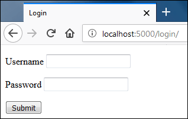

Запрос к странице был сделан с помощью метода **GET**, поэтому код внутри блока **if** функции **login()** пропущен.

Если попробовать отправить форму без ввода данных, страница будет выглядеть следующим образом:

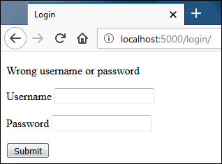

В этот раз страница была отправлена методом **POST**, поэтому код внутри **if** оказался исполнен. Внутри этого блока приложение принимает имя пользователя и пароль и устанавливает сообщение для **message**. *Поскольку форма оказалась пустой, отобразилось сообщение об ошибке.*

Если заполнить форму с корректными именем пользователям и паролем и нажать Enter, появится приветственное сообщение `“Correct username and password”`:

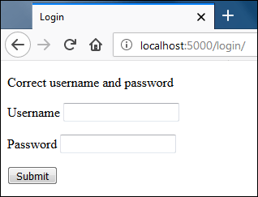

Таким образом можно работать с **формами** во **Flask**. Теперь же стоит обратить внимание на пакет **WTForms**.

### Пакет **WTForms**

**WTForms** – это мощная библиотека, написанная на **Python** и независимая от фреймворков. Она умеет генерировать формы, проверять их и предварительно заполнять информацией (удобно для редактирования) и многое другое. Также она предлагает защиту от **CSRF**. Для установки **WTForms** используется **Flask-WTF.**

**Flask- WTF** – это расширение для **Flask**, которое интегрирует **WTForms** во **Flask**. Оно также предлагает дополнительные функции, такие как загрузка файлов, **reCAPTCHA**, интернационализация **(i18n)** и другие. 

Для установки **Flask-WTF** нужно ввести следующую команду:

`(env) gvido@vm:~/flask_app$ pip install flask-wtf`


### Создание класса **Form**

Начать стоит с определения форм в виде классов *Python*. Каждая форма должна расширять класс **FlaskForm** из пакета **flask_wtf**. 

**FlaskForm** — это обертка, содержащая полезные методы для оригинального класса **wtform.Form**, который является основной для создания форм. Внутри класса формы, поля формы определяются в виде переменных класса. Поля формы определяются путем создания объекта, ассоциируемого с типом поля. Пакет **wtform** предлагает несколько классов, представляющих собой следующие поля: `StringField`, `PasswordField`, `SelectField`, `TextAreaField`, `SubmitField` и другие.

Для начала нужно создать файл **forms.py** внутри словаря **flask_app** и добавить в него следующий код:

```
from flask_wtf import FlaskForm
from wtforms import StringField, SubmitField, TextAreaField
from wtforms.validators import DataRequired, Email

class ContactForm(FlaskForm):
    name = StringField("Name: ", validators=[DataRequired()])
    email = StringField("Email: ", validators=[Email()])
    message = TextAreaField("Message", validators=[DataRequired()])
    submit = SubmitField("Submit")
```

Здесь определен класс формы **ContactForm** с четырьмя полями: `name`, `email`, `message` и `sumbit`. Эти переменные будут использоваться, чтобы *отрендерить поля формы, а также назначать и получать информацию из них*. 

Эта форма создана с помощью двух **StringField**, **TextAreaField** и **SumbitField**. Каждый раз когда создается *объект поля*, определенные аргументы передаются его *функции-конструктору*. Первый аргумент — **строка**, содержащая метку, которая будет отображаться внутри тега `<label>` в тот момент, когда поле отрендерится. Второй опциональный аргумент — **список валидаторов** (элементов системы проверки), которые передаются конструктору в виде аргументов-ключевых слов. 

**Валидаторы** — это функции или классы, которые определяют, корректна ли введенная в поле информация. Для каждого поля можно использовать несколько валидаторов, разделив их запятыми **(,)**. Модуль **wtforms.validators** предлагает базовые валидаторы, но их можно создавать самостоятельно. 

В этой **форме** используются два встроенных валидатора: **DataRequired** и **Email**.

**DataRequired** - он проверяет, ввел ли пользователь хоть какую-информацию в поле.

**Email** - проверяет, является ли введенный электронный адрес действующим.

Введенные данные не будут приняты до тех пор, пока валидатор не подтвердит соответствие данных.

**Примечание:**
Это лишь основа полей форм и валидаторов. Полный список доступен по [ссылке](https://wtforms.readthedocs.io)


### Установка **SECRET_KEY**

По умолчанию **Flask-WTF** предотвращает любые варианты **CSFR-атак**. Это делается с помощью встраивания специального токена в скрытый элемент `<input>` внутри формы. Затем этот токен используется для проверки подлинности запроса. До того как **Flask-WTF** сможет сгенерировать **csrf-токен**, необходимо добавить секретный ключ. 

Установить его в файле **main2.py** необходимо следующим образом:

```
#...
app.debug = True
app.config['SECRET_KEY'] = 'a really really really really long secret key'

manager = Manager(app)
#...
```

Здесь используется атрибут **config** объекта **Flask**. Атрибут **config** работает как словарь и используется для размещения параметров настройки **Flask** и расширений **Flask**, но их можно добавлять и самостоятельно.

*Секретный ключ* должен быть **строкой** — такой, которую сложно разгадать и, желательно, длинной. **SECRET_KEY** используется не только для создания **CSFR-токенов**. Он применяется и в других расширениях **Flask**. Секретный ключ должен быть безопасно сохранен. Вместо того чтобы хранить его в приложении, лучше разместить в переменной окружения. О том как это сделать — будет рассказано в следующих разделах.


### Формы в консоли

Откроем оболочку Python с помощью следующей команды:
```
(env)  gvido@vm:~/flask_app$  python main2.py  shell
```

Это запустит оболочку **Python** внутри контекста приложения.

Теперь нужно импортировать класс **ContactForm** и создать экземпляр объекта новой формы, передав данные формы:
```
>>>
>>> from forms import ContactForm
>>> from werkzeug.datastructures import MultiDict
>>>
>>>
>>> form1 = ContactForm(MultiDict([('name', 'jerry'),('email', 'jerry@mail.com')]))
>>>
```

Стоит обратить внимание, что данные передаются в виде объекта  **MultiDict**, потому что функция-конструктор класса **wtforms.Form** принимает аргумент типа **MutiDict**. Если данные формы не определены при создании экземпляра объекта формы, а форма отправлена с помощью запроса **POST**, **wtforms.Form** использует данные из атрибута **request.form**. Стоит вспомнить, что **request.form** возвращает объект типа **ImmutableMultiDict**. Это то же самое, что и **MultiDict**, но он неизменяемый.

Метод **validate()** проверяет форму. Если проверка прошла успешно, он возвращает **True**, если нет — **False**.

```
>>>
>>> form1.validate()
False
>>>
```

Форма не прошла проверку, потому что обязательному полю message при создании объекта формы не было передано никаких данных. Получить доступ к ошибкам форм можно с помощью атрибута **errors** объекта формы:
```
>>>
>>> form1.errors
{'message': ['This field is required.'], 'csrf_token': ['The CSRF token is missing.']}
>>>
```

Нужно обратить внимание, что в дополнение к сообщению об ошибке для поля **message**, вывод также содержит сообщение об ошибке о недостающем *csfr-токене*. Это из-за того что в данных формы нет запроса **POST** с **csfr-токеном**.

Отключить **CSFR-защиту** можно, передав `csfr_enabled=False` при создании экземпляра класса формы. 

**Пример:**

```
>>> form3 = ContactForm(MultiDict([('name', 'spike'),('email', 'spike@mail.com')]), csrf_enabled=False)
>>>
>>> form3.validate()
False
>>>
>>> form3.errors
{'message': ['This field is required.']}
>>>
>>>
```

Как и предполагалось, теперь ошибка появляется только для поля **message**. 

Теперь можно создать другой объект формы, но в этот раз передать ему информацию для всех полей:

```
>>>
>>> form4 = ContactForm(MultiDict([('name', 'jerry'), ('email', 'jerry@mail.com'), ('message', "hello tom")]),  csrf_enabled=False)
>>>
>>> form4.validate()
True
>>>
>>> form4.errors
{}
>>>
```

Проверка формы в этот раз прошла успешно. Следующий шаг — рендеринг формы.


### Рендеринг формы

Существует два варианта рендеринга:

* Один за одним
* С помощью цикла

#### Рендеринг полей один за одним

Поскольку в шаблонах есть доступ к экземпляру формы, можно использовать имена полей, чтобы отрендерить имена, метки и ошибки:
```
{# выводим название поля #}
{{ form.field_name.label() }}

{# выводим само поле #}
{{ form.field_name() }}

{# выводим ошибки валидации, связанные с полем #}

    {{ error }}

Стоит протестировать этот способ в консоли:

>>>
>>> from forms import ContactForm
>>> from jinja2 import Template
>>>
>>> form = ContactForm()
>>>
```

Здесь экземпляр объекта формы был создан без данных запроса. Так и происходит, когда форма отображается первый раз с помощью запроса **GET**.

```
>>>
>>>
>>> Template("{{ form.name.label() }}").render(form=form)
'<label for="name">Name: </label>'
>>>
>>> Template("{{ form.name() }}").render(form=form)
'<input id="name" name="name" type="text" value="">'
>>>
>>>
>>> Template("{{ form.email.label() }}").render(form=form)
'<label for="email">Email: </label>'
>>>
>>> Template("{{ form.email() }}").render(form=form)
'<input id="email" name="email" type="text" value="">'
>>>
>>>
>>> Template("{{ form.message.label() }}").render(form=form)
'<label for="message">Message</label>'
>>>
>>> Template("{{ form.message() }}").render(form=form)
'<textarea id="message" name="message"></textarea>'
>>>
>>>
>>> Template("{{ form.submit() }}").render(form=form)
'<input id="submit" name="submit" type="submit" value="Submit">'
>>>
>>>
```

Поскольку форма выводится первый раз, у полей не будет ошибок проверки. Следующий код наглядно демонстрирует это:

```
>>>
>>>
>>> Template("{{ error }}").render(form=form)
''
>>>
>>>
>>> Template("{{ error }}").render(form=form)
''
>>>
>>>
>>> Template("{{ error }}").render(form=form)
''
>>>
>>>
```

Вместо отображения ошибок проверки для каждого поля можно использовать **form.errors**, чтобы получить доступ к ошибкам валидации, относящимся к форме. **forms.errors** используется чтобы отображать ошибки проверки в верхней части формы.

```
>>>
>>> Template("{{ error }}").render(form=form)
''
>>>
```

При рендеринге полей и меток можно добавить дополнительные аргументы-ключевые слова, которые окажутся в **HTML-коде** в виде пар ключей-значений:

**Пример:**

```
>>>
>>> Template('{{ form.name(class="input", id="simple-input") }}').render(form=form)
'<input class="input" id="simple-input" name="name" type="text" value="">'
>>>
>>>
>>> Template('{{ form.name.label(class="lbl") }}').render(form=form)
'<label class="lbl" for="name">Name: </label>'
>>>
>>>
```

Предположим, форма была отправлена. Теперь можно попробовать отрендерить поля и посмотреть, что получится:

```
>>>
>>> from werkzeug.datastructures import MultiDict
>>>
>>> form = ContactForm(MultiDict([('name', 'spike'),('email', 'spike@mail.com')]))
>>>
>>> form.validate()
False
>>>
>>>
>>> Template("{{ form.name() }}").render(form=form)
'<input id="name" name="name" type="text" value="spike">'
>>>
>>>
>>> Template("{{ form.email() }}").render(form=form)
'<input id="email" name="email" type="text" value="spike@mail.com">'
>>>
>>>
>>> Template("{{ form.message() }}").render(form=form)
'<textarea id="message" name="message"></textarea>'
>>>
>>>
```

Стоит обратить внимание, что у атрибута **value** в полях **name** и **email** есть данные. Но элемент `<textarea>` для поля **message** пуст, потому что ему данные переданы не были. Получить доступ к ошибке валидации для поля **message** можно следующим образом:

```
>>>
>>> Template("{{ error }}").render(form=form)
'This field is required.'
>>>
```

Как вариант, **form.errors** можно использовать, чтобы перебрать все ошибки валидации за раз.

```
>>>
>>> s  ="""\
... \
... \
... <li>{{ field_name }}: {{ error }}</li>
... \
... \
... """
>>>
>>> Template(s).render(form=form)
'<li>csrf_token: The CSRF token is missing.</li>\n
<li>message: This field is required.</li>\n'
>>>
>>>
```

Стоит обратить внимание, что ошибки **csfr-токена** нет, потому что запрос был отправлен без токена. Отрендерить поле **csfr** можно как и любое другое поле:

```
>>>
>>>  Template("{{ form.csrf_token() }}").render(form=form)
'<input id="csrf_token" name="csrf_token" type="hidden" value="IjZjOTBkOWM4ZmQ0MGMzZTY3NDc3ZTNiZDIxZTFjNDAzMGU1YzEwOTYi.DQlFlA.GQ-PrxsCJkQfoJ5k6i5YfZMzC7k">'
>>>
```

Рендеринг полей один из одним может занять много времени, особенно если их несколько. Для таких случаев используется цикл.

### Рендеринг полей с помощью **цикла**

Следующий код демонстрирует, как можно отрендерить поля с помощью цикла **for**:

```
>>>
>>> s = """\
...     <div>
... 	    {{ form.csrf_token }}
... 	</div>
... 
... 	<div>
... 	    {{ field.label() }}
... 	    {{ field() }}
... 	    
... 		<div class="error">{{ error }}</div>
... 	    
... 	</div>
... 
... """
>>>
>>>
>>> print(Template(s).render(form=form))
    <div>
	<input id="csrf_token" name="csrf_token" type="hidden"  value="IjZjOTBkOWM4ZmQ0MGMzZTY3NDc3ZTNiZDIxZTFjNDAzMGU1YzEwOTYi.DQlFlA.GQ-PrxsCJkQfoJ5k6i5YfZMzC7k">
	
    </div>
    
    <div>
	<label for="name">Name: </label>
	<input id="name" name="name" type="text" value="spike">
	
    </div>

    <div>
	<label for="email">Email: </label>
	<input id="email" name="email" type="text"  value="spike@mail.com">
	
    </div>
    
    <div>
	<label for="message">Message</label>
	<textarea id="message" name="message"></textarea>
	
	    <div class="error">This field is required.</div>
	    
    </div>

    <div>
	<label for="submit">Submit</label>
	<input id="submit" name="submit" type="submit"  value="Submit">
	
    </div>
>>>
>>>
```

Важно заметить, что вне зависимости от используемого метода нужно вручную добавлять тег `<form>`, чтобы обернуть поля формы.


Теперь, зная как создавать, поверять и рендерить формы, можно использовать полученные знания для создания реальных форм.

Вначале нужно создать шаблон **contact.html** со следующим кодом:

```
<!DOCTYPE html>
<html lang="en">
<head>
    <meta charset="UTF-8">
    <title>Title</title>
</head>
<body>

<form action="" method="post">

    {{ form.csrf_token() }}

    
	<p>{{ field.label() }}</p>
	<p>{{ field }}
	    
		{{ error }}
	    
	</p>
    

</form>

</body>
</html>
```

Единственный недостающий кусочек пазла — функция представления, которая будет создана далее.


### Работа с подтверждением формы

Откроем **main2.py**, чтобы добавить следующий код после функции представления **login()**:

```
from flask import Flask, render_template, request, redirect,  url_for
from flask_script import Manager, Command, Shell
from forms import ContactForm
#...
@app.route('/contact/', methods=['get', 'post'])
def contact():
    form = ContactForm()
    if form.validate_on_submit():
	name = form.name.data
	email = form.email.data
	message = form.message.data
	print(name)
	print(email)
	print(message)
	# здесь логика базы данных
	print("\nData received. Now redirecting ...")
	return redirect(url_for('contact'))

    return render_template('contact.html', form=form)
#...
```

В **7** строке создается объект формы. На **8** строке проверяется значение, которое вернул метод **validate_on_submit()** для исполнения кода внутри инструкции **if**.

* Почему используется **validate_on_sumbit()**, а **не validate()**, как это было в консоли?

**validate()** всего лишь проверяет, корректны ли данные формы. Он не проверяет, был ли запрос отправлен с помощью метода **POST**. Это значит, что если использовать метод **validate()**, тогда запрос **GET** к `/contact/` запустит форму проверки, а пользователь увидит ошибки валидации. 

Вообще процедура проверки запускается только в том случае, если данные были отправлены с помощью метода **POST**. В противном случае вернется **False**. 

Метод **validate_on_submit()** вызывает метод **validate()** внутри себя. Также нужно обратить внимание, что при создании экземпляра объекта формы данные не передаются, потому что когда форма отправляется с помощью запроса **POST**, **WTForm** считывает данные формы из атрибута **request.form**.

Поля формы, определенные в классе формы становятся атрибутами объекта формы. Чтобы получить доступ к данным поля используется атрибут data поля формы:

**form.name.data**  - доступ к данным в поле name.

**form.email.data** - доступ к данным в поле email.

Чтобы получить доступ ко всем данные формы сразу нужно использовать атрибут data к объекту формы:

**form.data**  - доступ ко всем данным

Если использовать запрос **GET** при посещении `/contact/`, метод `validate_on_sumbit()` вернет **False**. Код внутри **if** будет пропущен, а пользователь получит пустую **HTML-форму**.

Когда **форма** отправляется с помощью запроса **POST**, то **validate_on_sumbit()** возвращает *True*, предполагая, что данные верны. Вызовы **print()** внутри блока **if** выведут данные, введенные пользователем, а функция **redirect()** перенаправит пользователя на страницу `/contact/`. С другой стороны, если **validate_on_sumbit()** вернет *False*, исполнение инструкций внутри тела **if** будет пропущено, и появится сообщение об ошибке валидации.

Если сервер не запущен, его нужно запустить и открыть `https://localhost:5000/contact/`. Появится следующая контактная форма:

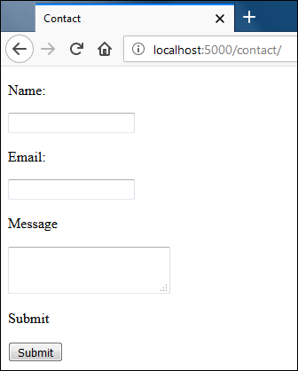

Если попробовать нажать **Submit**, не вводя данных, появятся следующие сообщения об ошибках валидации:

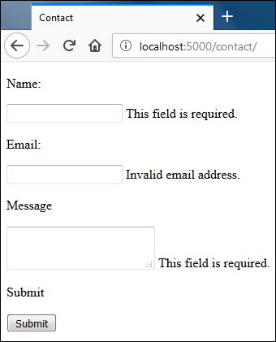

Теперь можно ввести определенные данные в поля **Name** и **Message** и некорректные данные в поле **Email**, и попробовать отправить форму снова:

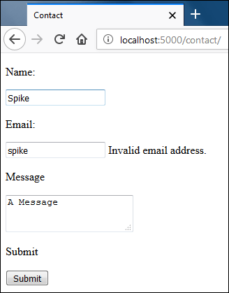

Нужно обратить внимание, что все поля содержат данные из прошлого запроса.

Теперь можно ввести корректный **email** в поле **Email** и нажать *Submit*. Теперь проверка пройдет успешно, а в оболочке появится следующий вывод:
```
Spike
spike@gmail.com
A Message

Data received. Now redirecting  ...
```

После отображения принятых данных в оболочке функция представления перенаправит пользователя по адресу `/contact/`. В этот момент должна отображаться пустая форма без ошибок валидации так, будто пользователь впервые открыл `/contact/` с помощью запроса **GET**.

Рекомендуется отображать обратную связь пользователю после успешной отправки. Во **Flask** это делается с помощью всплывающих сообщений.


### Всплывающие сообщения

**Всплывающие сообщения** — еще одна из тех функций, которые зависят от секретного ключа. Он необходим, потому что сообщения хранятся в **сессиях**. 

**Сессиям** во Flask будет посвящен отдельный урок. Поскольку в этом уроке секретный ключ уже был настроен, можно двигаться дальше.

Для отображения сообщения используется функция **flash()** из пакета **flask.** Функция **flash()** принимает два аргумента: *сообщение* и *категория (опционально)*. Категория указывает на тип сообщения: `_success_`, `_error_`, `_warning_` и так далее. Категория может быть использована в шаблоне, чтобы определить тип сообщения.

Снова откроем **main2.py**, чтобы добавить **flash(“Message Received”, “success”)** прямо перед вызовом **redirect()** в функции представления **contact()**:

```
from flask import Flask, render_template, request, redirect, url_for, flash
#...
	# здесь логика базы данных
	print("\nData received. Now redirecting ...")
	flash("Message Received", "success")
	return redirect(url_for('contact'))
    return render_template('contact.html', form=form)
```

Сообщение, заданное с помощью функции **flash()**, будет доступно только последующему запросу, а потом удалится.

Это только настройка сообщения. Для его отображения нужно поменять также шаблон.

Для этого нужно открыть файл **contact.html** и изменить его следующим образом:

**Jinja** предлагает функцию **get_flashed_messages()**, которая возвращает список активных сообщений без категории. Чтобы получить их вместе с категорией нужно передать **with_category=True** при вызове **get_flashed_messages()**. Когда значение **with_categories** – *True*, **get_flashed_messages()** вернет список кортежей формы **(category, message)**.

После этих изменений следует открыть `https://localhost:5000/contact` снова. Заполнить форму и нажать **Submit**. 

Сообщение об успешной отправке отобразится в верхней части формы:

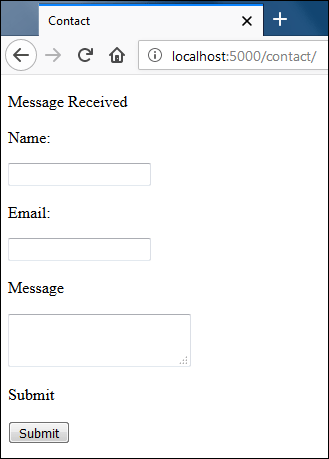


---


# 12. Куки во Flask

До этого момента все созданные в уроках страницы были очень простыми. Браузер отправляет запрос на сервер, сервер отвечает HTML-страницей, и это все. HTTP — это протокол, который не сохраняет свое состояние. Это значит, что в HTTP нет встроенных способов сообщить серверу, что оба запроса поступили от одного и того же пользователя. В результате сервер не знает, пытается ли пользователь получить доступ к странице впервые или в тысячный раз. Он обслуживает каждого так, будто бы это первое обращение к странице.

Если попробовать зайти в любой интернет-магазин и поискать определенные товары, то при следующем посещении сайт будет предлагать рекомендации, основанные на примерах прошлых поисков. Как же получается, что сайт узнает конкретного пользователя?

Ответ — куки и сессии.

Этот урок посвящен куки, а о сессиях речь пойдет в следующем.

### Что такое куки?

**Куки** — это всего лишь фрагмент данных, которые сервер устанавливает в браузере. 

*Вот как это работает:*

1. Браузер отправляет запрос на получение веб-страницы от сервера.
2. Сервер отвечает на запрос, отправляя запрошенную страницу вместе с одним или несколькими куки.
3. При получении ответа браузер рендерит страницу и сохраняет куки на компьютере пользователя.
4. Последующий запрос на сервер будет включать информацию из куки в заголовке Cookie. 
* Так будет продолжаться, пока не истечет сроки куки. Как только это происходит, куки удаляется из браузера.


### Настройка куки

Во **Flask** для настройки куки используется метод объекта ответа **set_cookie()**. 

Синтаксис **set_cookie()** следующий:

**set_cookie(key, value="", max_age=None)**

**key** — обязательный аргумент, это название куки. 

**value** — данные, которые нужно сохранить в куки. По умолчанию это пустая строка. 

**max_age** — это срок действия куки в секундах. Если не указать срок, срок истечет при закрытии браузера пользователем.


Откроем **main2.py**, чтобы добавить следующий код после функции представления **contact()**:

```
from flask import Flask, render_template, request, redirect, url_for, flash, make_response
#...
@app.route('/cookie/')
def cookie():
    res = make_response("Setting a cookie")
    res.set_cookie('foo', 'bar', max_age=60*60*24*365*2)
    return res
#...
```

Это пример создание куки под названием **foo** со значением **bar**, срок которых — **2 года**.

Нужно запустить сервер и зайти на [https://localhost:5000/cookie/](https://localhost:5000/cookie/). В качестве ответа откроется страница “Setting a cookie”. Чтобы посмотреть куки, настроенные сервером, нужно открыть инспектор хранилища в Firefox, нажав Shift+F9. Новое окно откроется в нижней части браузера. С левой стороны необходимо выбрать тип хранилища “Cookies” и нажать https://localhost:5000/, чтобы посмотреть все куки, настроенные сервером для [https://localhost:5000/](https://localhost:5000/).

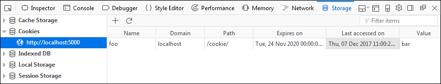

С этого момента куки foo будут отправляться вместе с запросом на сервер [https://localhost:5000/](https://localhost:5000/). Убедиться в этом можно с помощью сетевого монитора в *Firefox*. Он открывается сочетанием **Ctrl+Shift+E**. В мониторе нужно открыть [https://localhost:5000/](https://localhost:5000/). В списке запросов с левой стороны — выбрать первый запрос, чтобы в правой панели отобразились его подробности:

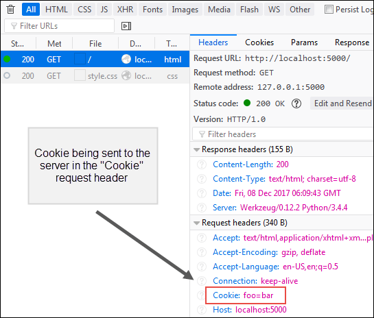

Стоит отметить, что когда куки настроены, последующие запросы к [https://localhost:5000/cookie/](https://localhost:5000/cookie/) будут обновлять срок куки.


### Доступ к куки

Для доступа к куки используется **атрибут cookie** объекта **request**. 

**cookie** — это атрибут типа словарь, содержащий все куки, отправленные браузером. 

Снова откроем *main2.py*, чтобы изменить функцию представления **cookie()**:

```
#...
@app.route('/cookie/')
def cookie():
    if not request.cookies.get('foo'):
	res = make_response("Setting a cookie")
	res.set_cookie('foo', 'bar', max_age=60*60*24*365*2)
    else:
	res = make_response("Value of cookie foo is {}".format(request.cookies.get('foo')))
    return res
#...
```
Функция представления изменена таким образом, чтобы страница показывала значение куки, если они есть. Если нет — они будут настроены автоматически.

Если открыть [https://localhost:5000/cookie/](https://localhost:5000/cookie/) сейчас, отобразится страница со следующим содержимым:

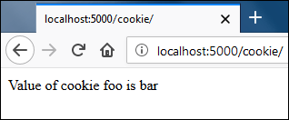

Объект **request** также доступен внутри шаблона. Это значит, что доступ к куки можно получить и с помощью кода **Python**. Подробнее об в этом в одном из следующих разделов.

### Удаление куки

Чтобы удалить куки, нужно вызвать метод **set_cookie()** с названием куки, любым значением и указать срок **max_age=0**. 

В файле **main2.py** это можно сделать, добавив следующий код после функции представления **cookie()**:

```
#...
@app.route('/delete-cookie/')
def delete_cookie():
    res = make_response("Cookie Removed")
    res.set_cookie('foo', 'bar', max_age=0)
    return res
#...
```

Если сейчас зайти на [https://localhost:5000/delete-cookie/](https://localhost:5000/delete-cookie/), отобразится следующий ответ:

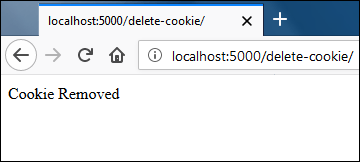

Теперь, понимая как работают куки, можно изучить следующие примеры кода и получить реальные практические примеры того, как настраивать куки для сохранения пользовательских предпочтений.

Добавим следующий код после функции представления **delete_cookie()** в файле **main2.py**:

```
#...
@app.route('/article/', methods=['POST',  'GET'])
def article():
    if request.method == 'POST':
	print(request.form)
	res = make_response("")
	res.set_cookie("font", request.form.get('font'), 60*60*24*15)
	res.headers['location'] = url_for('article')
	return res, 302

    return render_template('article.html')
#...
```

Далее нужно создать новый шаблон **article.html** со следующим кодом:

```
<!DOCTYPE html>
<html lang="en">
<head>
    <meta charset="UTF-8">
    <title>Article</title>
</head>
<body style="font-family:{{ request.cookies.get('font') }}">

Select Font Preference: <br>
<form action="" method="post">
    <select name="font" onchange="submit()">
	<option value="">----</option>
	<option value="consolas" selected>consolas</option>
	<option value="arial" selected>arial</option>
	<option value="verdana" selected>verdana</option>
    </select>
</form>

<h1>Festus, superbus toruss diligenter tractare de brevis, dexter olla.</h1>

<p>Lorem ipsum dolor sit amet, consectetur adipisicing elit. Aperiam blanditiis debitis doloribus eos magni minus odit, provident tempora. Expedita fugiat harum in incidunt minus nam nesciunt voluptate. Facilis nesciunt, similique!
</p>

<p>Lorem ipsum dolor sit amet, consectetur adipisicing elit. Alias amet animi aperiam inventore molestiae quos, reiciendis voluptatem. Ab, cum cupiditate fugit illo incidunt ipsa neque quam, qui quidem vel voluptatum.</p>


</body>
</html>
```

При первом посещении [https://localhost:5000/article](https://localhost:5000/article) страница отобразится со шрифтом по умолчанию. Если пользователь поменяет шрифт с помощью выпадающего меню, будет отправлена форма. Значение условия if request.method == 'POST' станет истинным, и будут настроены куки font со значением выбранного шрифта, срок которых истечет через 15 дней, а пользователь будет перенаправлен на страницу [https://localhost:5000/article](https://localhost:5000/article), которая отобразится с новым выбранным шрифтом.

При посещении [https://localhost:5000/article](https://localhost:5000/article) станица отобразится со шрифтом по умолчанию:

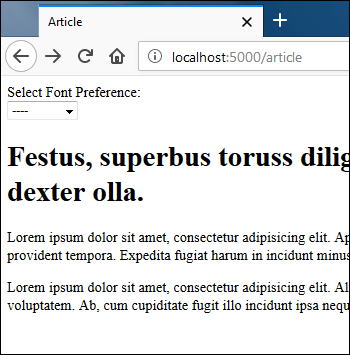

Но если выбрать новый шрифт из выпадающего меню, шрифт страницы поменяется на выбранный ранее:

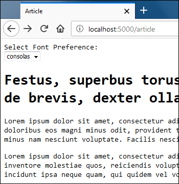


### Недостатки куки

Перед использованием куки в реальном проекте нужно знать об их недостатках.

1. Куки небезопасны. Данные, которые в них хранятся, видны всем, поэтому в куки нельзя хранить пароли, данные банковских карт и так далее.

2. Куки можно отключить. Большинство браузеров дают пользователям возможность отключить куки. Если это происходит, никакого предупреждения нет. Чтобы бороться с этой проблемой, можно использовать, например, такой простейший JS-код, чтобы уведомить пользователя о том, что куки должны быть включены для корректной работы.

```
<script>
    document.cookie = "foo=bar;";
    if (!document.cookie)
    {
	alert("This website requires cookies to function properly");
    }
</script>
```

3. Каждая порция куки хранит не более 4 КБ данных. Помимо этого браузеры накладывают ограничения на то, сколько куки может установить сайт. Лимиты варьируются от 30 до 50.

4. Куки отправляются с каждым запросом к серверу. Если предположить, что у сайта 20 куки размером 4 КБ, то каждый запрос будет давать дополнительную нагрузку в размере 80 КБ.

Некоторые из этих проблем можно решить с помощью сессий, речь о которых пойдет в следующем уроке.


---


# 13 Сессии во Flask

**Сессии** — еще один способ хранить данные конкретных пользователей между запросами. Они работают по похожему на куки принципу. Для использования сессии нужно сперва настроить секретный ключ. 

Объект **session** из пакета **flask** используется для настройки и получения данных сессии. Объект **session** работает как словарь, но он также может отслеживать изменения.

При использовании сессий данные хранятся в браузере как куки. 

**Куки сессии** — это куки, используемые для хранения данных сессии. 

Тем не менее в отличие от обычных куки **Flask** криптографически отмечает куки сессии. Это значит, что каждый может видеть содержимое куки, *но не может их менять, не имея секретного ключа для подписи*. Как только куки сессии настроены, каждый последующий запрос к серверу подтверждает подлинность куки с помощью такого же секретного ключа. Если **Flask** не удается это сделать, тогда его контент отклоняется, а браузер получает новые куки сессии.

Такой **тип сессий**, используемях во **Flask**, называется **клиентскими сессиями**.

По умолчанию различий между куки и клиентскими сессиями во Flask не так много. В итоге клиентские сессии страдают от тех же недостатков, что и обычные куки:

* Не могут хранить конфиденциальную информацию, такую как пароли.

* Дают лишнюю нагрузку при каждом запросе.

* Не способны хранить больше 4 КБ.

* Ограничены в общем количестве куки для одного сайта

Единственное реальное различие между куки и клиентскими сессиями — Flask гарантирует, что содержимое куки сессии не может быть изменено пользователям (только если у него нет секретного ключа).

Для использования клиентских сессий во Flask можно или написать собственный интерфейс сессии или использовать **расширения**, такие как **Flask-Session** или **Flask-KVSession**.


### Как читать, записывать и удалять данные сессии

* Следующий код демонстрирует, как можно читать, записывать и удалять данные сессии. 

Откроем файл **main2.py**, чтобы добавить следующий код после функции представления article():

```
from flask import  Flask, render_template, request, redirect, url_for, flash, make_response, session
#...
@app.route('/visits-counter/')
def visits():
    if 'visits' in session:
	session['visits'] = session.get('visits') + 1  # чтение и обновление данных сессии
    else:
	session['visits'] = 1  # настройка данных сессии
    return "Total visits: {}".format(session.get('visits'))

@app.route('/delete-visits/')
def delete_visits():
    session.pop('visits', None)  # удаление данных о посещениях
    return 'Visits deleted'
#...
```

Стоит обратить внимание, что объект session используется как обычный словарь. Если сервер не запущен, нужно его запустить и зайти на [https://localhost:5000/visits-counter/](https://localhost:5000/visits-counter/). На странице будет счетчик посещений:

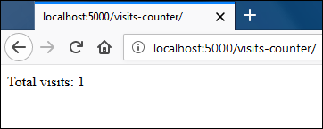

Чтобы его увеличить, нужно несколько раз обновить страницу.

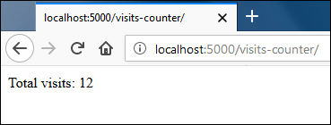 

**Flask** отправляет куки сессии клиенту только при создании новой сессии или изменении существующей. При первом посещении [https://localhost:5000/visits-counter/](https://localhost:5000/visits-counter/) будет исполнено тело **else** в функции представления **visits()**, в результате чего будет создана новая сессия. 

При создании новой сессии **Flask** отправит куки сессии клиенту. Последующие запросы к [https://localhost:5000/visits-counter/](https://localhost:5000/visits-counter/) приведут к исполнению кода в блоке **if**, в котором обновляется значение счетчика **visits** сессии. При изменении сессии будет создан новый файл куки, поэтому **Flask** отправит новые куки сессии клиенту.

* Чтобы удалить данные сессии нужно зайти на [https://localhost:5000/delete-visits/](https://localhost:5000/delete-visits/):

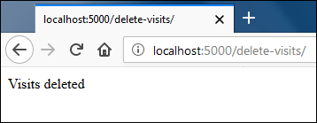

Если сейчас открыть [https://localhost:5000/visits-counter](https://localhost:5000/visits-counter), счетчик посещений снова будет показывать 1:


По умолчанию куки сессии существуют до тех пор, пока не закроется браузер. Чтобы продлить жизнь куки сессии, нужно установить значение *True* для атрибута **permanent** объекта **session**. Когда значение **permanent** равно *True*, срок куки сессии будет равен **permanent_session_lifetime**. 

**permanent_session_lifetime** — это атрибут **datetime.timedelta** объекта **Flask**. Его значение по умолчанию равно *31 дню*. Изменить его можно, выбрав новое значение для атрибута **permanent_session_lifetime**, используя ключ настройки **PERMANENT_SESSION_LIFETIME**:

```
import datetime

app = Flask(__name__)
app.permanent_session_lifetime = datetime.timedelta(days=365)
# app.config['PERMANENT_SESSION_LIFETIME'] = datetime.timedelta(days=365)
```

Как и request, объект **sessions** доступен в шаблонах.

### Изменение данных сессии

*Важно! - перед тем как следовать инструкции, нужно удалить все куки, установленные локальным хостом.*

Большую часть времени объект **session** автоматически подхватывает изменения. Но бывают случаи, например изменение структуры изменяемых данных, которые не подхватываются автоматически. Для таких ситуаций нужно установить значение *True* для атрибута **modified** объекта **session**. Если этого не сделать, **Flask** не будет отправлять обновленные куки клиенту. 

Следующий код показывает, как использовать атрибут **modified** объекта **session**. Откроем файл **main2.py**, чтобы добавить следующий код перед функцией представления **delete_visitis()**:

```
#...
@app.route('/session/')
def updating_session():
    res = str(session.items())

    cart_item = {'pineapples': '10', 'apples': '20', 'mangoes': '30'}
    if 'cart_item' in session:
	session['cart_item']['pineapples'] = '100'
	session.modified = True
    else:
	session['cart_item'] = cart_item

    return res
#...
```

При первом посещении [https://localhost:5000/session/](https://localhost:5000/session/) код в блоке **else** будет исполнен. Он создаст новую сессию, где данные сессии будут в виде словаря. Последующий запрос к [https://localhost:5000/session/](https://localhost:5000/session/) обновляет данные сессии, установив количество «ананасов» на значении **100**. В следующей строке атрибут **modified** получает значение *True*, потому что без него **Flask** не будет отправлять обновленные куки сессии клиенту.

Если сервер не запущен, его следует запустить и зайти на [https://localhost:5000/session/](https://localhost:5000/session/). Отобразится пустой словарь **session**, потому что у браузера еще нет куки сессии, которые он мог бы отправить серверу:

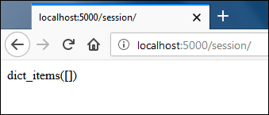

Если страницу перезагрузить, в словаре **session** будет уже **«10 ананасов»**:

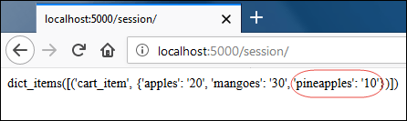

Перезагрузив страницу в третий раз, можно увидеть, что словарь **session** имеет значение **«ананасов»** равное **100**, а не 10.

Объект сессии подхватил изменение благодаря атрибуту **modified**. Удостовериться в этом можно, удалив куки сессии и закомментировав строку, где для атрибута **modified** устанавливается значение *True*. Теперь после первого запроса значение словаря сессии будет равно *«10 ананасам»*.

Это все, что нужно знать о сессиях во **Flask**. И важно не забывать, что по умолчанию сессии во **Flask** являются клиентскими.

---


